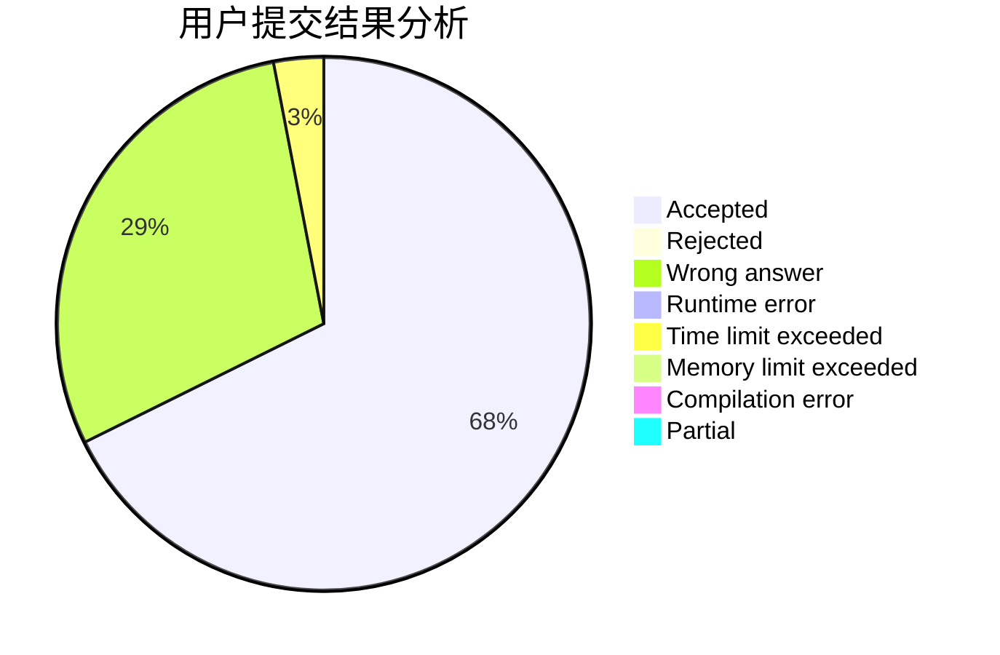
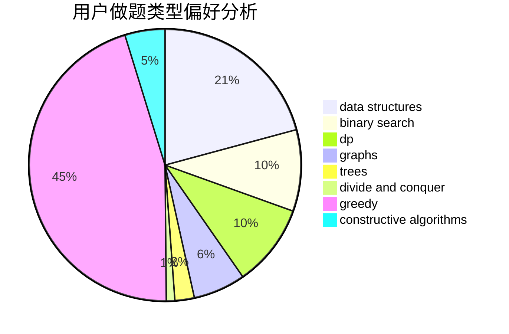
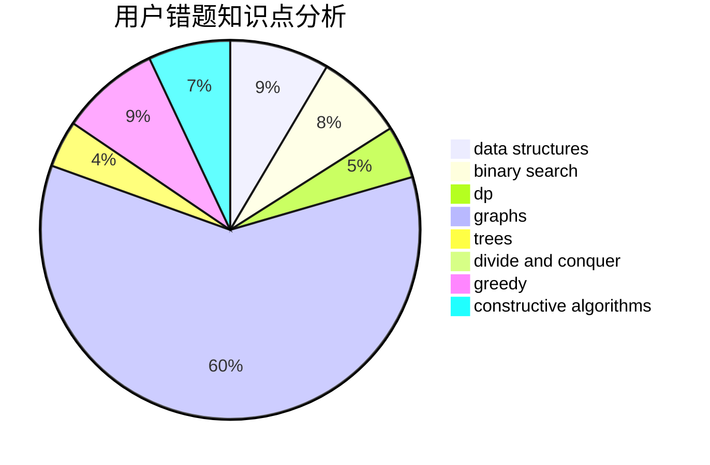

# jiuruifu

<!-- tabs:start -->

#### **用户提交结果分析**

#### **用户做题类型偏好分析**

#### **用户错题知识点分析**

<!-- tabs:end -->
# 推荐题目
[266B](https://codeforces.com/contest/266/problem/B)		constructive algorithms,
                        graph matchings,
                        implementation,
                        shortest paths		  
[1315C](https://codeforces.com/contest/1315/problem/C)		greedy		  
[611F](https://codeforces.com/contest/611/problem/F)		binary search,
                        implementation		  
[1283A](https://codeforces.com/contest/1283/problem/A)		math		  
[215B](https://codeforces.com/contest/215/problem/B)		greedy,
                        math		  
[1129D](https://codeforces.com/contest/1129/problem/D)		data structures,
                        dp		  
[816B](https://codeforces.com/contest/816/problem/B)		binary search,
                        data structures,
                        implementation		  
[385E](https://codeforces.com/contest/385/problem/E)		math,
                        matrices		  
[1491F](https://codeforces.com/contest/1491/problem/F)		binary search,
                        constructive algorithms,
                        interactive		  
[1016A](https://codeforces.com/contest/1016/problem/A)		greedy,
                        implementation,
                        math		  
