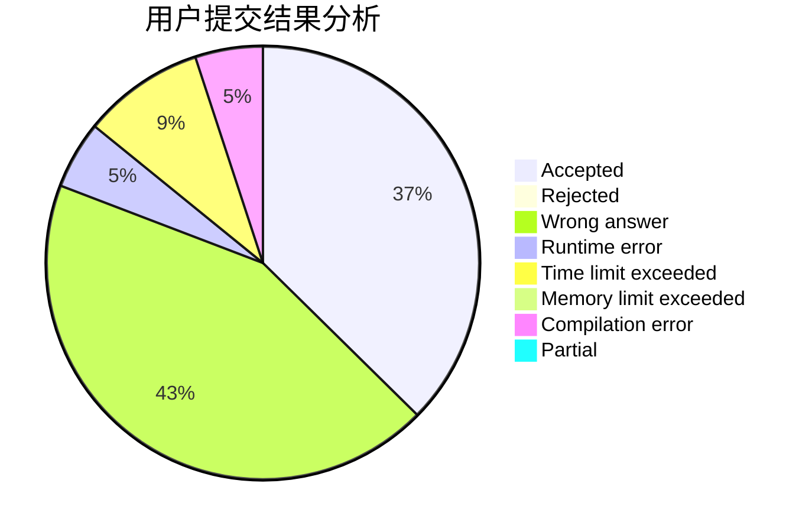
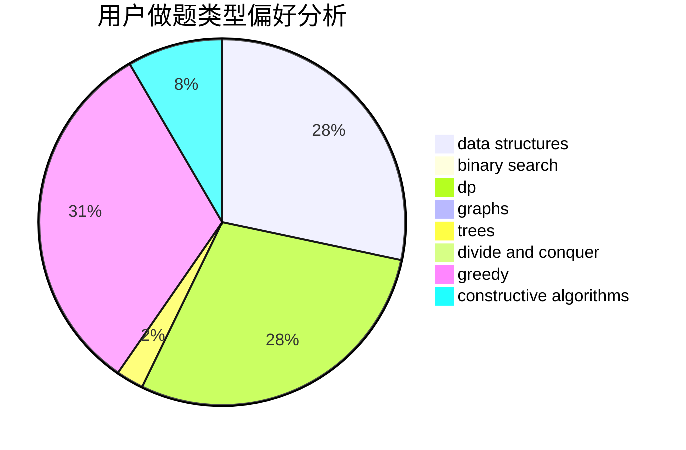

# jjikkollp

<!-- tabs:start -->

#### **用户提交结果分析**

#### **用户做题类型偏好分析**

#### **用户错题知识点分析**

<!-- tabs:end -->
# 推荐题目
[1446C](https://codeforces.com/contest/1446/problem/C)		binary search,
                        bitmasks,
                        data structures,
                        divide and conquer,
                        dp,
                        trees		  
[1435C](https://codeforces.com/contest/1435/problem/C)		dsu,graphs,sortings,trees		  
[1364D](https://codeforces.com/contest/1364/problem/D)		constructive algorithms,
                        dfs and similar,
                        graphs,
                        greedy,
                        implementation,
                        trees		  
[279B](https://codeforces.com/contest/279/problem/B)		binary search,
                        brute force,
                        implementation,
                        two pointers		  
[176B](https://codeforces.com/contest/176/problem/B)		dp		  
[772D](https://codeforces.com/contest/772/problem/D)		bitmasks,
                        dp		  
[1322A](https://codeforces.com/contest/1322/problem/A)		greedy		  
[817B](https://codeforces.com/contest/817/problem/B)		combinatorics,
                        implementation,
                        math,
                        sortings		  
[464C](https://codeforces.com/contest/464/problem/C)		dp		  
[497E](https://codeforces.com/contest/497/problem/E)		dp,
                        matrices		  
