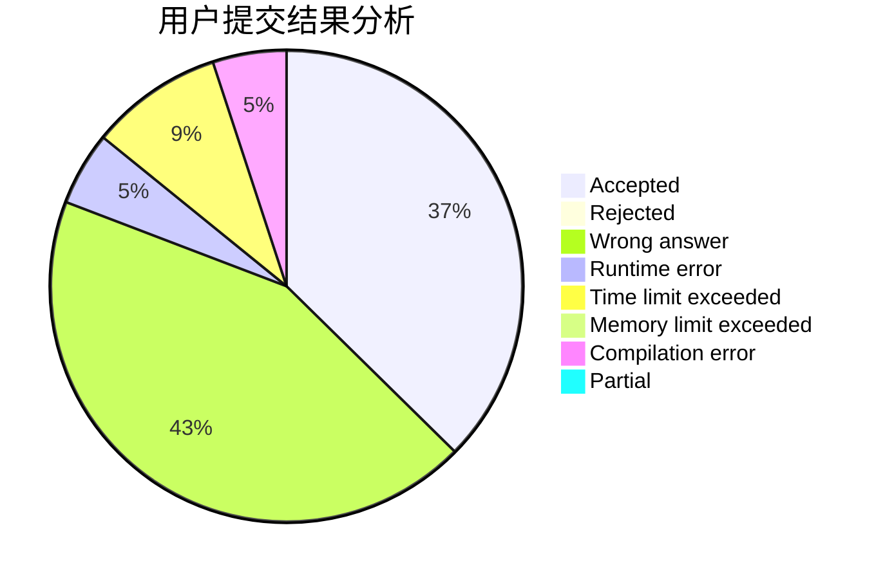
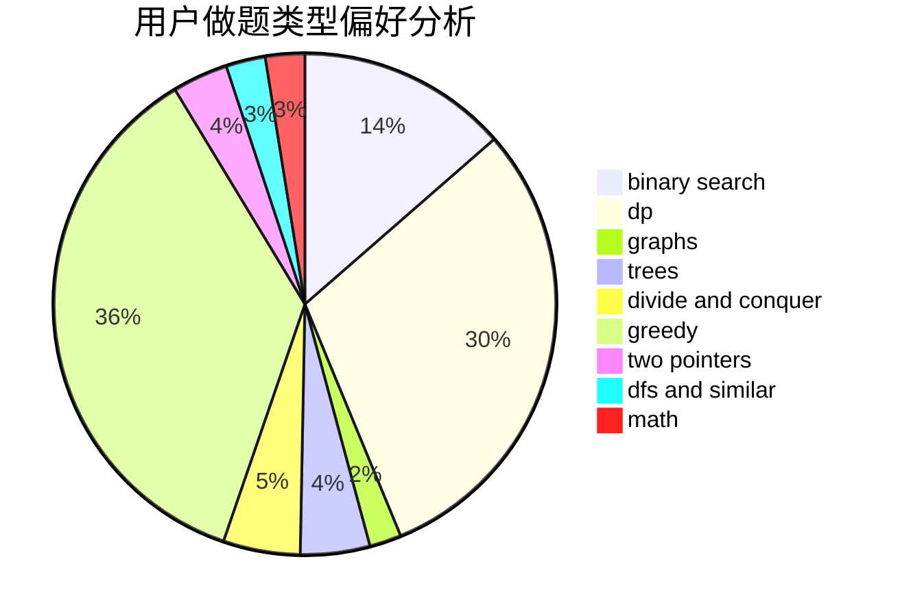

# jjikkollp

<!-- tabs:start -->

#### **用户提交结果分析**

#### **用户做题类型偏好分析**

<!-- tabs:end -->
# 推荐题目
[1446C](https://codeforces.com/contest/1446/problem/C)
[1435C](https://codeforces.com/contest/1435/problem/C)
[1364D](https://codeforces.com/contest/1364/problem/D)
[279B](https://codeforces.com/contest/279/problem/B)
[176B](https://codeforces.com/contest/176/problem/B)
[772D](https://codeforces.com/contest/772/problem/D)
[1322A](https://codeforces.com/contest/1322/problem/A)
[817B](https://codeforces.com/contest/817/problem/B)
[464C](https://codeforces.com/contest/464/problem/C)
[497E](https://codeforces.com/contest/497/problem/E)
