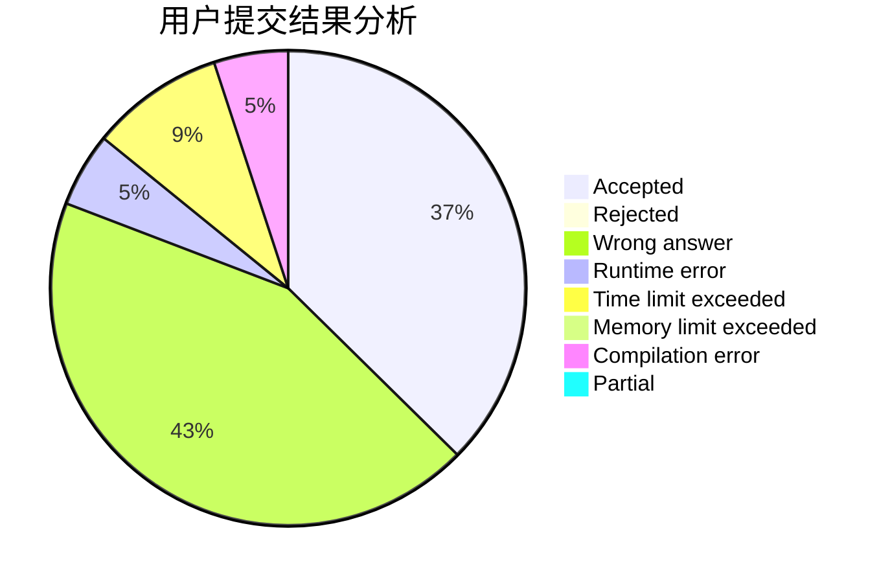
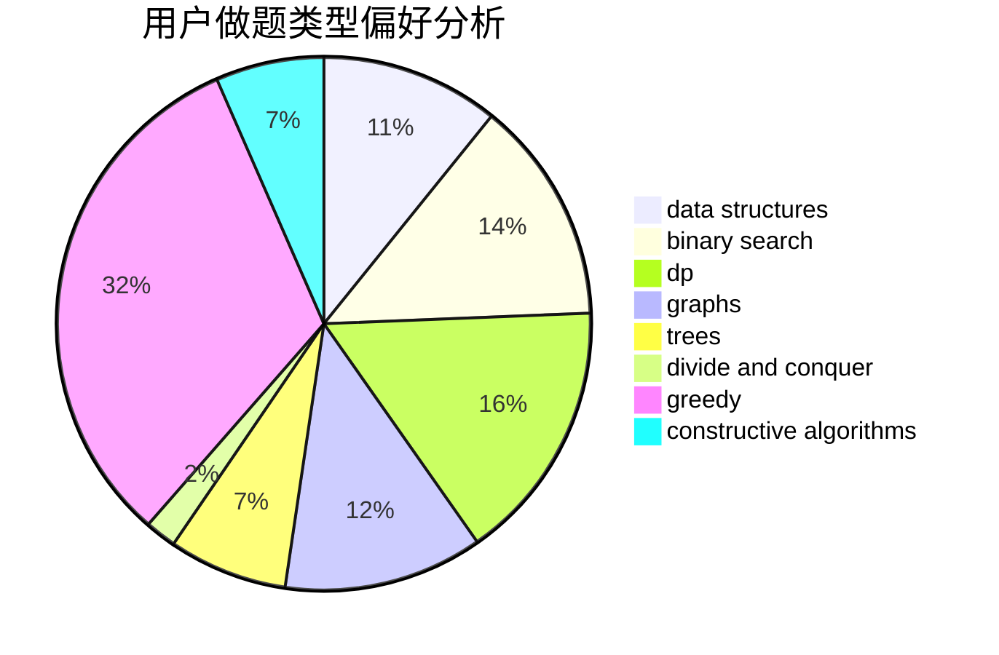

# jjikkollp

<!-- tabs:start -->

#### **用户提交结果分析**

#### **用户做题类型偏好分析**

#### **用户错题知识点分析**

<!-- tabs:end -->
# 推荐题目
[1436E](https://codeforces.com/contest/1436/problem/E)		binary search,
                        data structures,
                        two pointers		  
[1426F](https://codeforces.com/contest/1426/problem/F)		combinatorics,
                        dp,
                        strings		  
[1357B1](https://codeforces.com/contest/1357B/problem/1)		nan		  
[260D](https://codeforces.com/contest/260/problem/D)		constructive algorithms,
                        dsu,
                        graphs,
                        greedy,
                        trees		  
[154C](https://codeforces.com/contest/154/problem/C)		graphs,
                        hashing,
                        sortings		  
[754C](https://codeforces.com/contest/754/problem/C)		brute force,
                        constructive algorithms,
                        dp,
                        implementation,
                        strings		  
[1312E](https://codeforces.com/contest/1312/problem/E)		dp,
                        greedy		  
[802C](https://codeforces.com/contest/802/problem/C)		flows		  
[444D](https://codeforces.com/contest/444/problem/D)		binary search,
                        hashing,
                        strings,
                        two pointers		  
[477E](https://codeforces.com/contest/477/problem/E)		data structures		  
