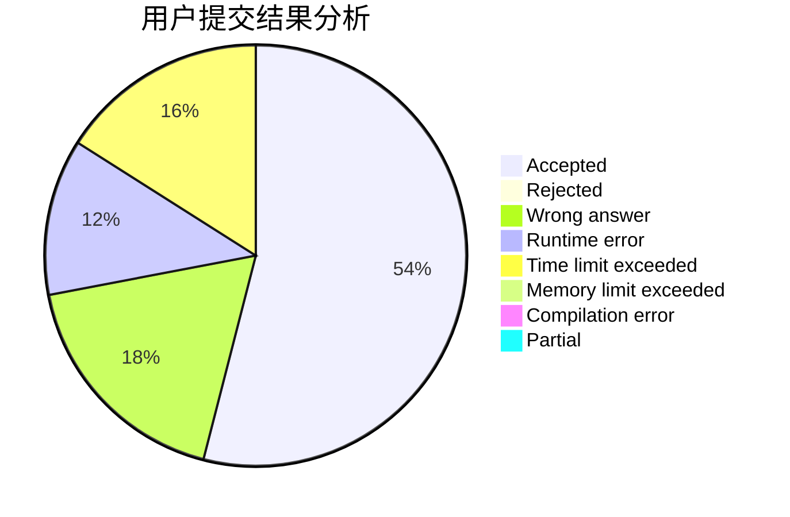
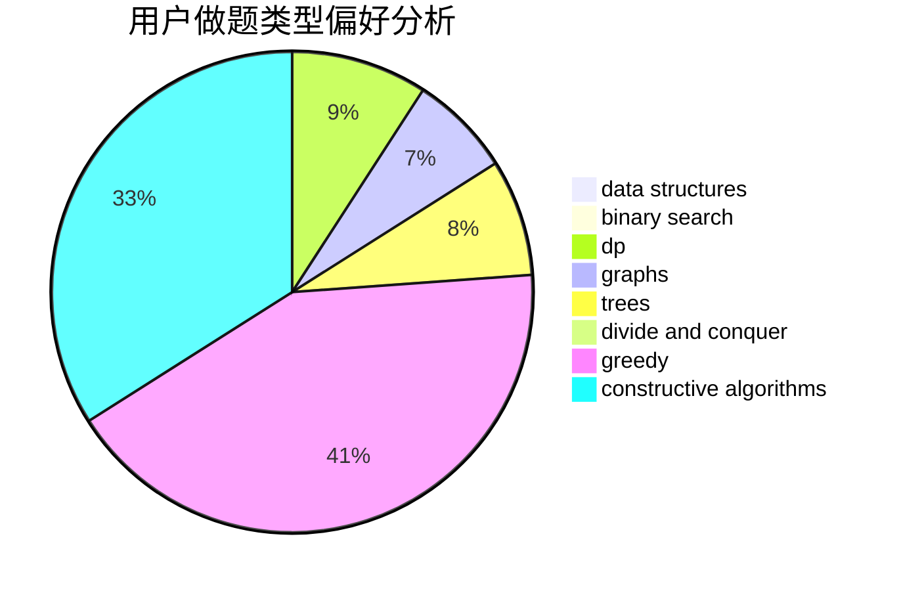
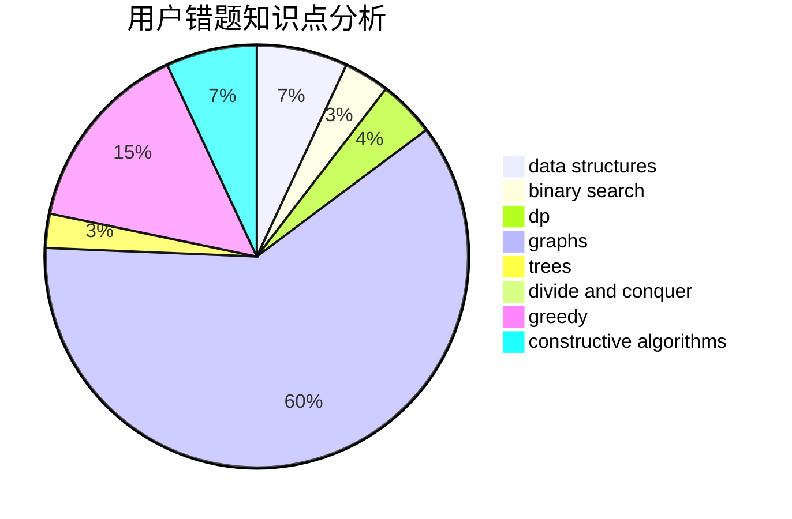

# jkisnotcs

<!-- tabs:start -->

#### **用户提交结果分析**

#### **用户做题类型偏好分析**

#### **用户错题知识点分析**

<!-- tabs:end -->
# 推荐题目
[940A](https://codeforces.com/contest/940/problem/A)		brute force,
                        greedy,
                        sortings		  
[1405C](https://codeforces.com/contest/1405/problem/C)		dsu,graphs,sortings,trees		  
[377E](https://codeforces.com/contest/377/problem/E)		dp,
                        geometry		  
[418C](https://codeforces.com/contest/418/problem/C)		dsu,graphs,sortings,trees		  
[317C](https://codeforces.com/contest/317/problem/C)		constructive algorithms,
                        dfs and similar,
                        graphs,
                        trees		  
[789C](https://codeforces.com/contest/789/problem/C)		dsu,graphs,sortings,trees		  
[1082E](https://codeforces.com/contest/1082/problem/E)		binary search,
                        dp,
                        greedy		  
[747F](https://codeforces.com/contest/747/problem/F)		brute force,
                        combinatorics,
                        dp,
                        math		  
[1178F1](https://codeforces.com/contest/1178F/problem/1)		combinatorics,
                        dfs and similar,
                        dp		  
[796C](https://codeforces.com/contest/796/problem/C)		constructive algorithms,
                        data structures,
                        dp,
                        trees		  
