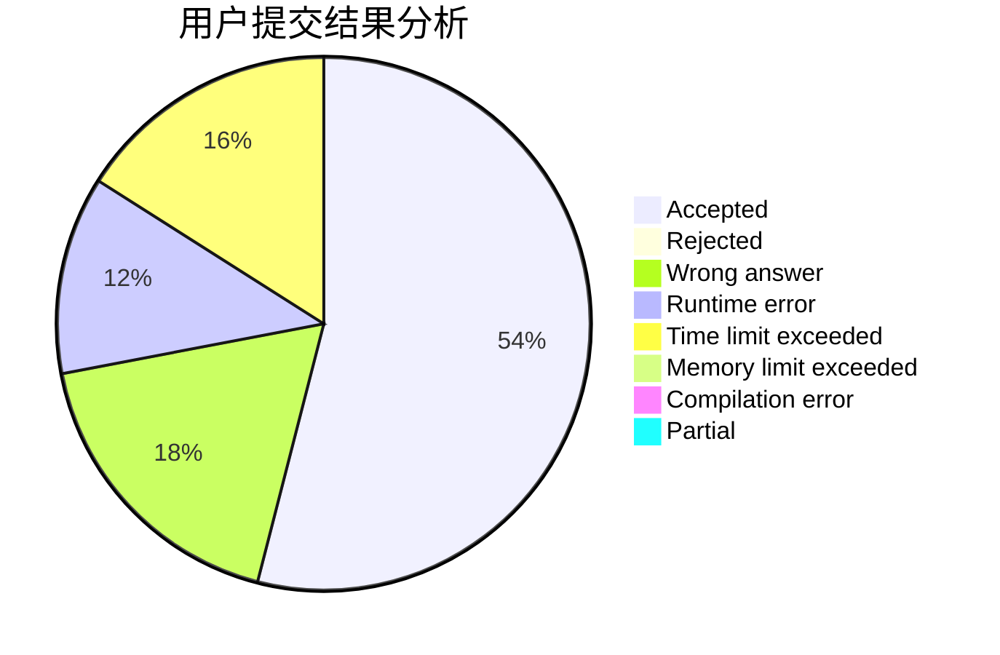
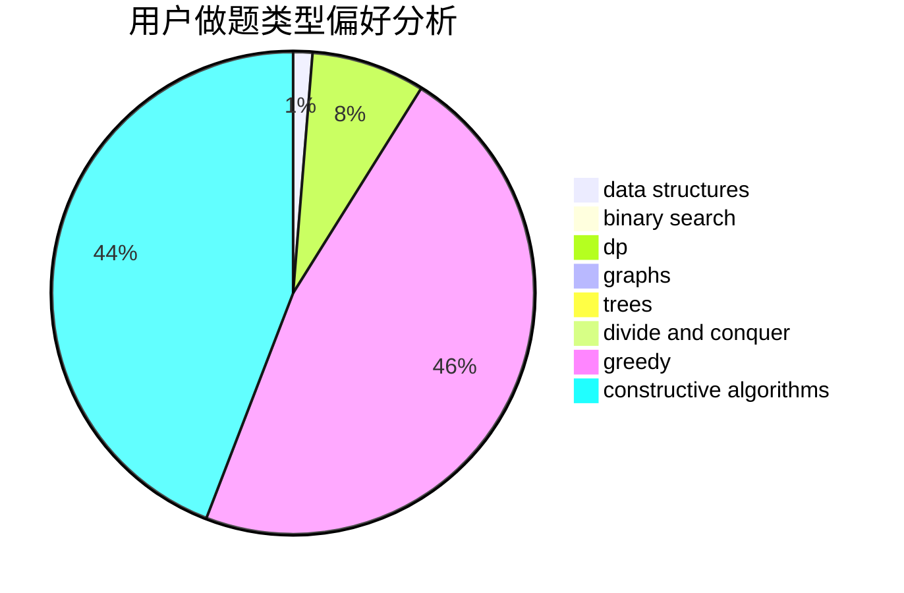
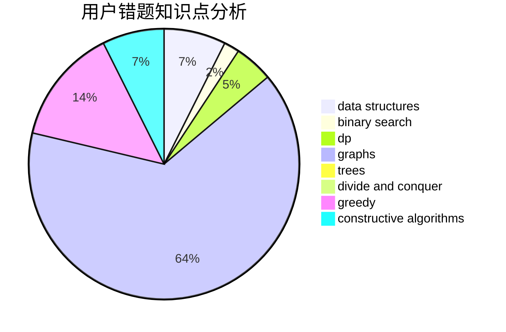

# jkisnotcs

<!-- tabs:start -->

#### **用户提交结果分析**

#### **用户做题类型偏好分析**

#### **用户错题知识点分析**

<!-- tabs:end -->
# 推荐题目
[961E](https://codeforces.com/contest/961/problem/E)		data structures		  
[1416D](https://codeforces.com/contest/1416/problem/D)		data structures,
                        dsu,
                        graphs,
                        implementation,
                        trees		  
[407B](https://codeforces.com/contest/407/problem/B)		dp,
                        implementation		  
[443D](https://codeforces.com/contest/443/problem/D)		dsu,graphs,sortings,trees		  
[346E](https://codeforces.com/contest/346/problem/E)		math,
                        number theory		  
[804E](https://codeforces.com/contest/804/problem/E)		constructive algorithms		  
[1083A](https://codeforces.com/contest/1083/problem/A)		data structures,
                        dp,
                        trees		  
[767C](https://codeforces.com/contest/767/problem/C)		dfs and similar,
                        graphs,
                        greedy,
                        trees		  
[1181A](https://codeforces.com/contest/1181/problem/A)		greedy,
                        math		  
[810D](https://codeforces.com/contest/810/problem/D)		dsu,graphs,sortings,trees		  
