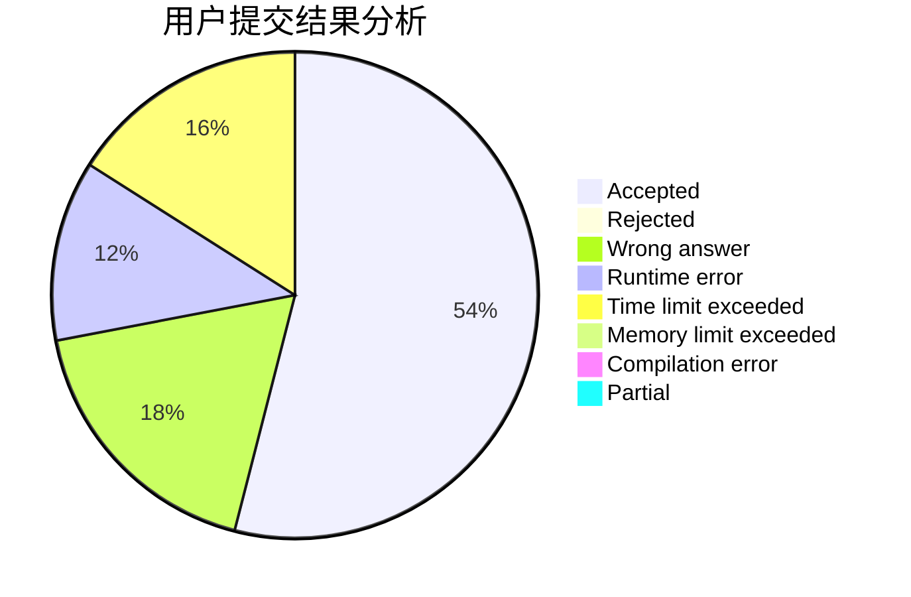
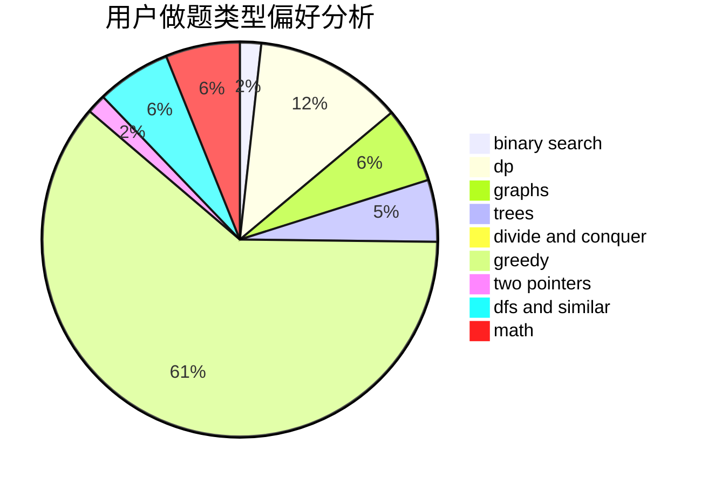

# jkisnotcs

<!-- tabs:start -->

#### **用户提交结果分析**

#### **用户做题类型偏好分析**

<!-- tabs:end -->
# 推荐题目
[961E](https://codeforces.com/contest/961/problem/E)
[1416D](https://codeforces.com/contest/1416/problem/D)
[407B](https://codeforces.com/contest/407/problem/B)
[443D](https://codeforces.com/contest/443/problem/D)
[346E](https://codeforces.com/contest/346/problem/E)
[804E](https://codeforces.com/contest/804/problem/E)
[1083A](https://codeforces.com/contest/1083/problem/A)
[767C](https://codeforces.com/contest/767/problem/C)
[1181A](https://codeforces.com/contest/1181/problem/A)
[810D](https://codeforces.com/contest/810/problem/D)
