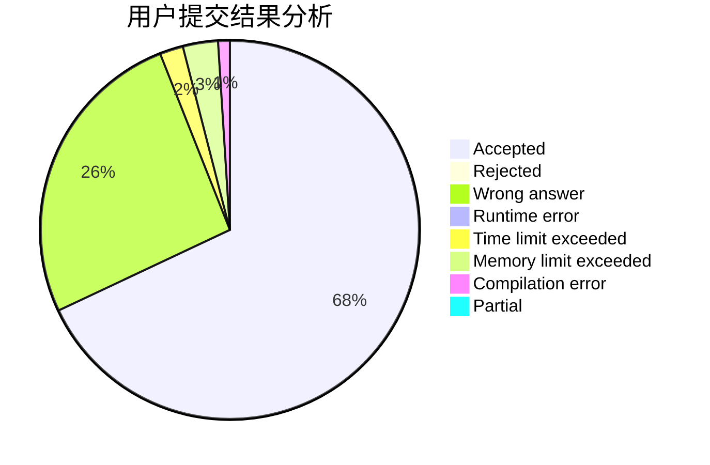
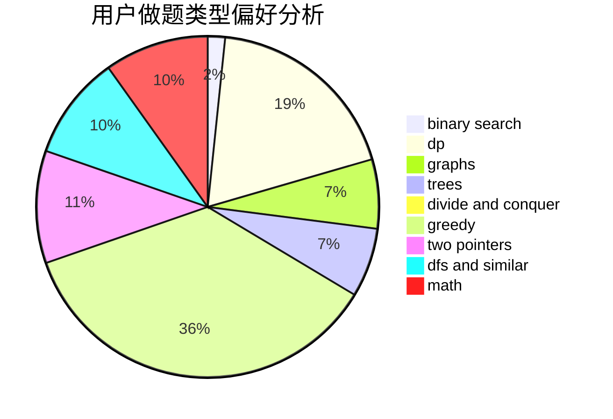

# jkxjkx1031

<!-- tabs:start -->

#### **用户提交结果分析**

#### **用户做题类型偏好分析**

<!-- tabs:end -->
# 推荐题目
[600C](https://codeforces.com/contest/600/problem/C)
[735C](https://codeforces.com/contest/735/problem/C)
[1147E](https://codeforces.com/contest/1147/problem/E)
[697B](https://codeforces.com/contest/697/problem/B)
[52B](https://codeforces.com/contest/52/problem/B)
[977B](https://codeforces.com/contest/977/problem/B)
[1242E](https://codeforces.com/contest/1242/problem/E)
[816C](https://codeforces.com/contest/816/problem/C)
[13773](https://codeforces.com/contest/1377/problem/3)
[1482A](https://codeforces.com/contest/1482/problem/A)
