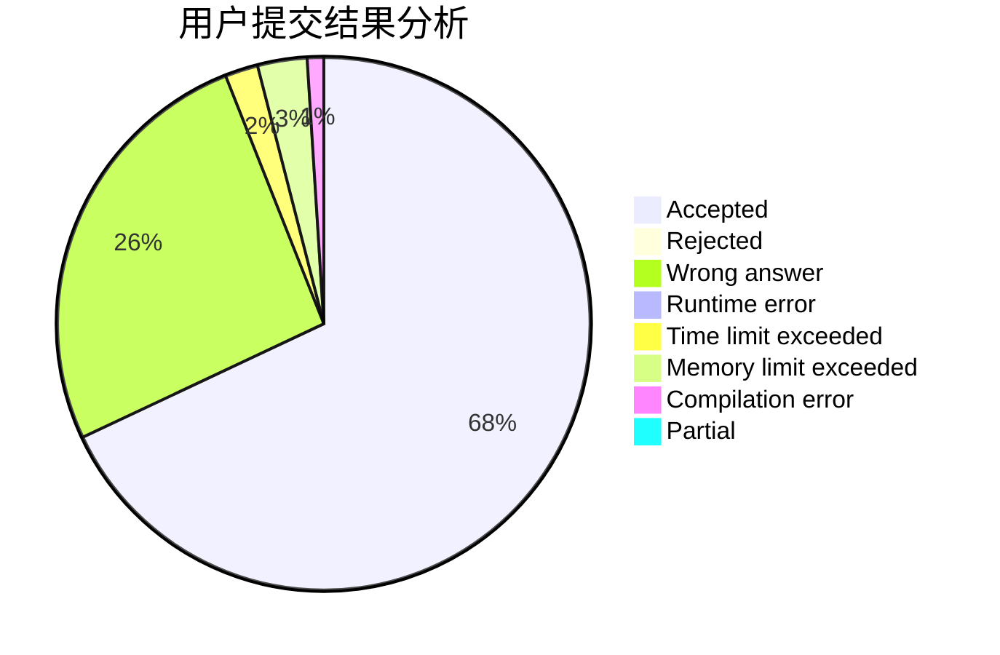
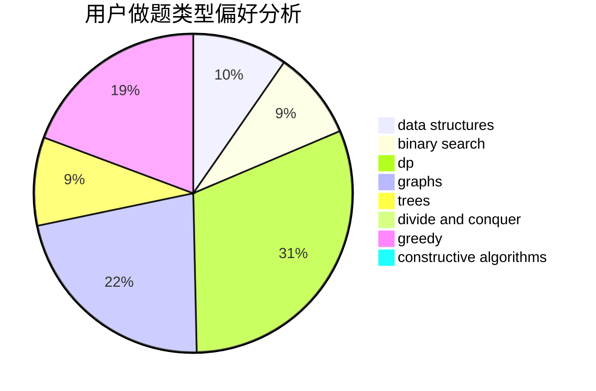

# jkxjkx1031

<!-- tabs:start -->

#### **用户提交结果分析**

#### **用户做题类型偏好分析**

#### **用户错题知识点分析**

<!-- tabs:end -->
# 推荐题目
[580A](https://codeforces.com/contest/580/problem/A)		brute force,
                        dp,
                        implementation		  
[717I](https://codeforces.com/contest/717/problem/I)		geometry		  
[1145D](https://codeforces.com/contest/1145/problem/D)		implementation		  
[671C](https://codeforces.com/contest/671/problem/C)		data structures,
                        number theory		  
[509C](https://codeforces.com/contest/509/problem/C)		dp,
                        greedy,
                        implementation		  
[955B](https://codeforces.com/contest/955/problem/B)		implementation		  
[1237G](https://codeforces.com/contest/1237/problem/G)		data structures,
                        dp,
                        greedy		  
[801C](https://codeforces.com/contest/801/problem/C)		dsu,graphs,sortings,trees		  
[136B](https://codeforces.com/contest/136/problem/B)		implementation,
                        math		  
[1473D](https://codeforces.com/contest/1473/problem/D)		data structures,
                        dp,
                        implementation,
                        strings		  
