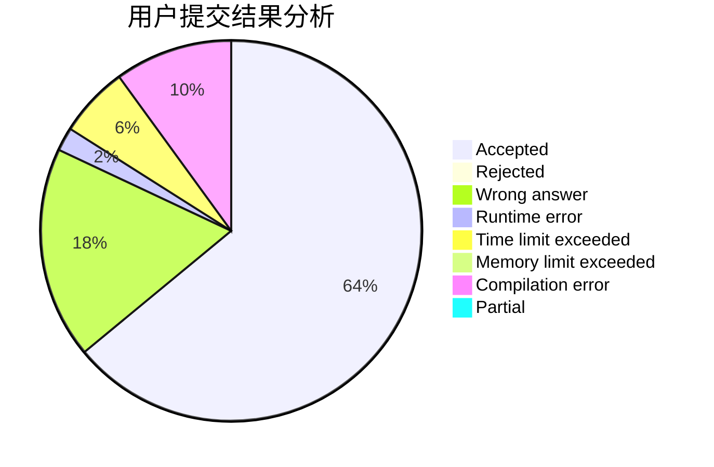
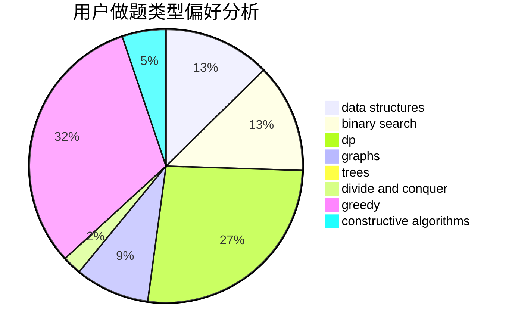
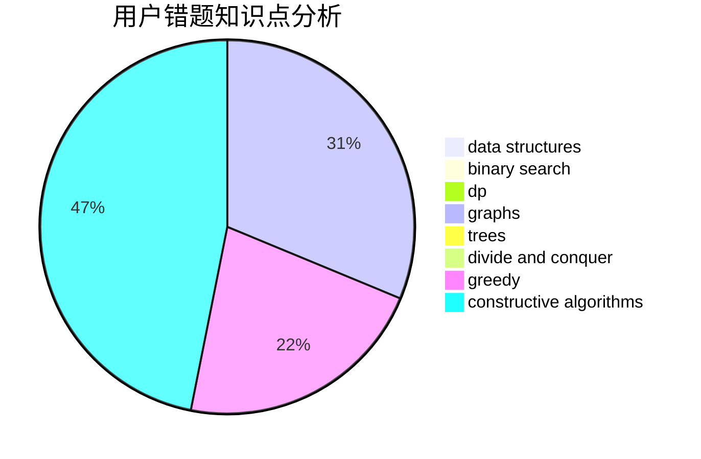

# jnxxhzz

<!-- tabs:start -->

#### **用户提交结果分析**

#### **用户做题类型偏好分析**

#### **用户错题知识点分析**

<!-- tabs:end -->
# 推荐题目
[1229B](https://codeforces.com/contest/1229/problem/B)		dsu,graphs,sortings,trees		  
[779A](https://codeforces.com/contest/779/problem/A)		constructive algorithms,
                        math		  
[1082F](https://codeforces.com/contest/1082/problem/F)		dp,
                        strings,
                        trees		  
[1187D](https://codeforces.com/contest/1187/problem/D)		data structures,
                        sortings		  
[272D](https://codeforces.com/contest/272/problem/D)		combinatorics,
                        math,
                        sortings		  
[1214E](https://codeforces.com/contest/1214/problem/E)		constructive algorithms,
                        graphs,
                        math,
                        sortings,
                        trees		  
[667C](https://codeforces.com/contest/667/problem/C)		dsu,graphs,sortings,trees		  
[388D](https://codeforces.com/contest/388/problem/D)		math		  
[224B](https://codeforces.com/contest/224/problem/B)		bitmasks,
                        implementation,
                        two pointers		  
[1261A](https://codeforces.com/contest/1261/problem/A)		dsu,graphs,sortings,trees		  
