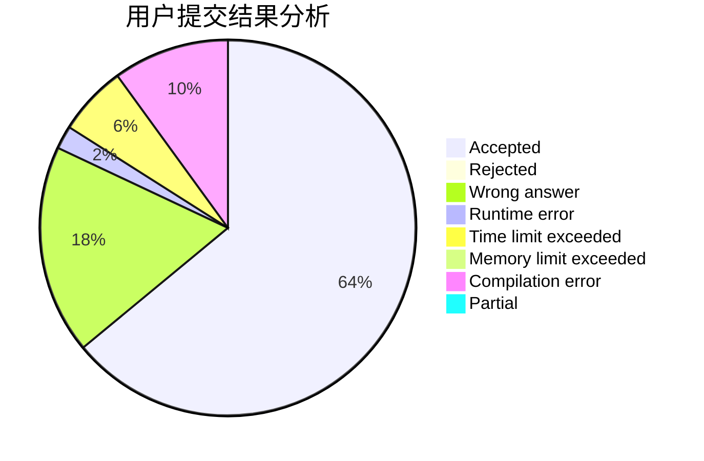
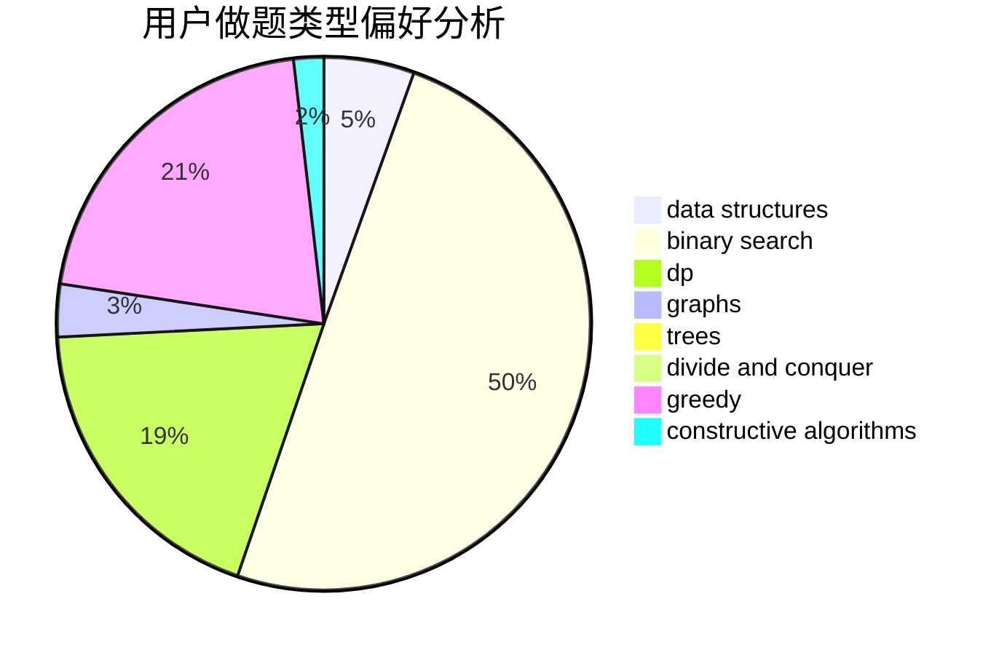
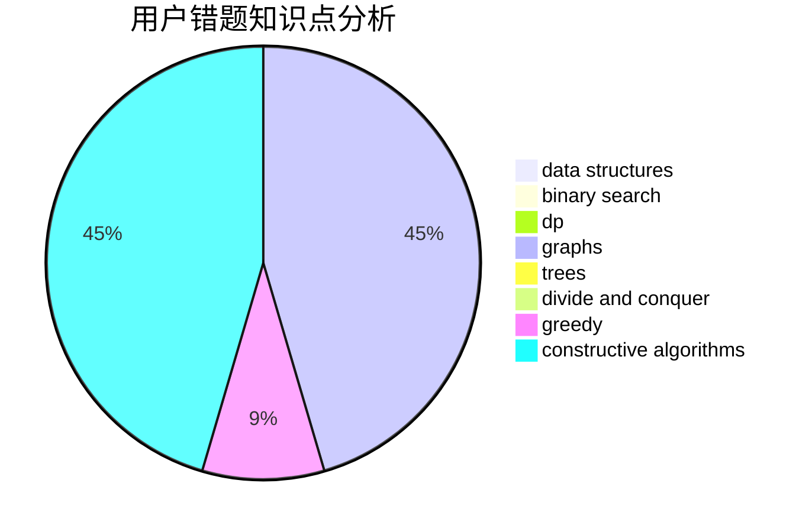

# jnxxhzz

<!-- tabs:start -->

#### **用户提交结果分析**

#### **用户做题类型偏好分析**

#### **用户错题知识点分析**

<!-- tabs:end -->
# 推荐题目
[1237F](https://codeforces.com/contest/1237/problem/F)		combinatorics,
                        dp		  
[797C](https://codeforces.com/contest/797/problem/C)		data structures,
                        greedy,
                        strings		  
[1083B](https://codeforces.com/contest/1083/problem/B)		greedy,
                        strings		  
[1191A](https://codeforces.com/contest/1191/problem/A)		brute force		  
[288D](https://codeforces.com/contest/288/problem/D)		combinatorics,
                        dfs and similar,
                        trees		  
[1220A](https://codeforces.com/contest/1220/problem/A)		implementation,
                        sortings,
                        strings		  
[689D](https://codeforces.com/contest/689/problem/D)		binary search,
                        data structures		  
[418A](https://codeforces.com/contest/418/problem/A)		dsu,graphs,sortings,trees		  
[243B](https://codeforces.com/contest/243/problem/B)		graphs,
                        sortings		  
[1266G](https://codeforces.com/contest/1266/problem/G)		string suffix structures		  
