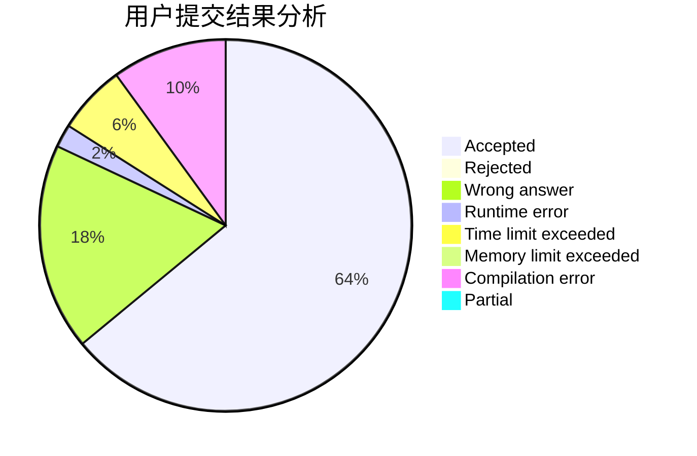
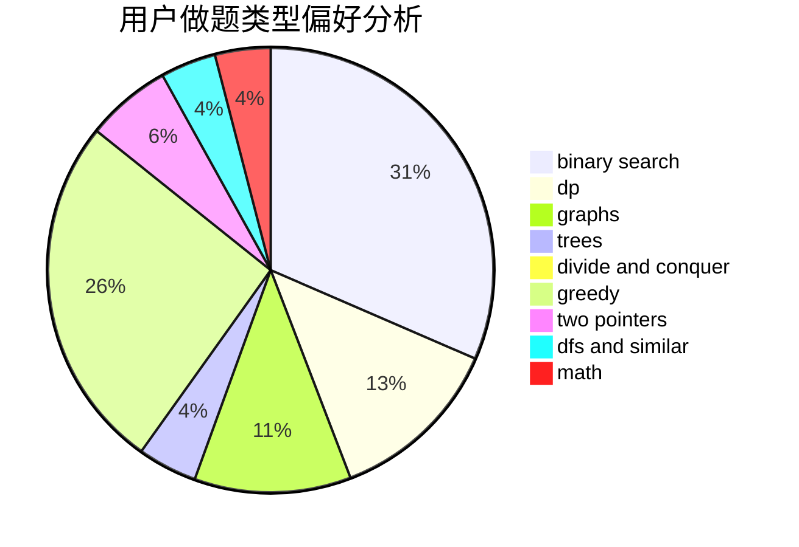

# jnxxhzz

<!-- tabs:start -->

#### **用户提交结果分析**

#### **用户做题类型偏好分析**

<!-- tabs:end -->
# 推荐题目
[1237F](https://codeforces.com/contest/1237/problem/F)
[797C](https://codeforces.com/contest/797/problem/C)
[1083B](https://codeforces.com/contest/1083/problem/B)
[1191A](https://codeforces.com/contest/1191/problem/A)
[288D](https://codeforces.com/contest/288/problem/D)
[1220A](https://codeforces.com/contest/1220/problem/A)
[689D](https://codeforces.com/contest/689/problem/D)
[418A](https://codeforces.com/contest/418/problem/A)
[243B](https://codeforces.com/contest/243/problem/B)
[1266G](https://codeforces.com/contest/1266/problem/G)
