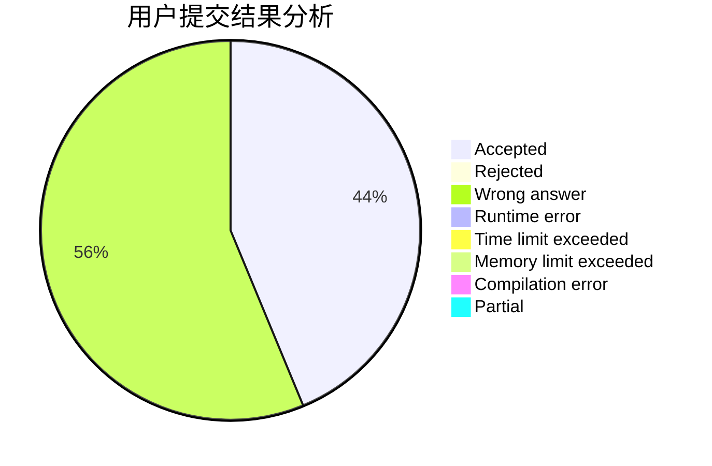
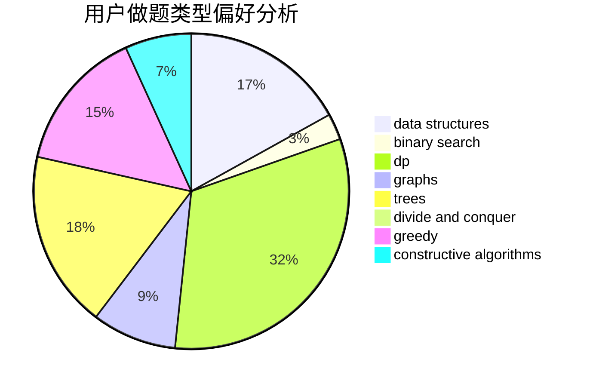
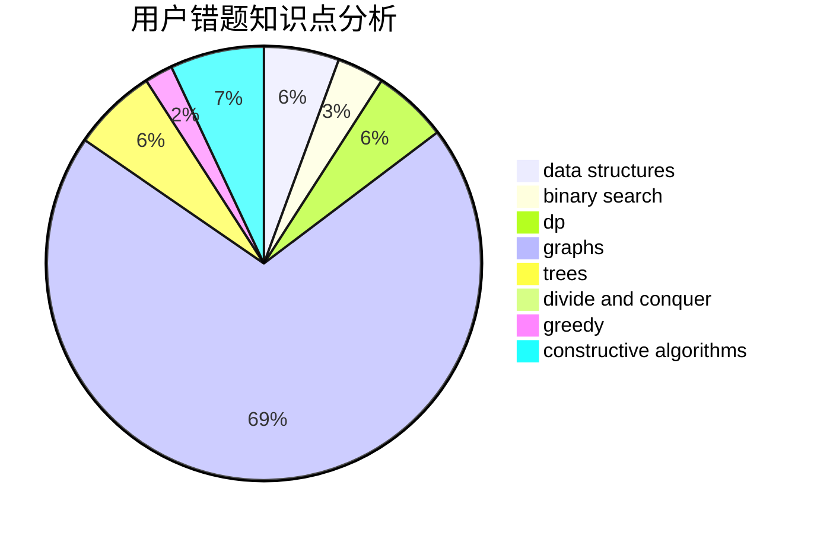

# js_xudongxin

<!-- tabs:start -->

#### **用户提交结果分析**

#### **用户做题类型偏好分析**

#### **用户错题知识点分析**

<!-- tabs:end -->
# 推荐题目
[1469E](https://codeforces.com/contest/1469/problem/E)		bitmasks,
                        brute force,
                        hashing,
                        string suffix structures,
                        strings,
                        two pointers		  
[701C](https://codeforces.com/contest/701/problem/C)		binary search,
                        strings,
                        two pointers		  
[1068C](https://codeforces.com/contest/1068/problem/C)		constructive algorithms,
                        graphs		  
[1243A](https://codeforces.com/contest/1243/problem/A)		implementation		  
[914H](https://codeforces.com/contest/914/problem/H)		combinatorics,
                        dp,
                        games,
                        trees		  
[732B](https://codeforces.com/contest/732/problem/B)		dp,
                        greedy		  
[2A](https://codeforces.com/contest/2/problem/A)		hashing,
                        implementation		  
[877B](https://codeforces.com/contest/877/problem/B)		brute force,
                        dp		  
[746C](https://codeforces.com/contest/746/problem/C)		constructive algorithms,
                        implementation,
                        math		  
[279D](https://codeforces.com/contest/279/problem/D)		bitmasks,
                        dp		  
