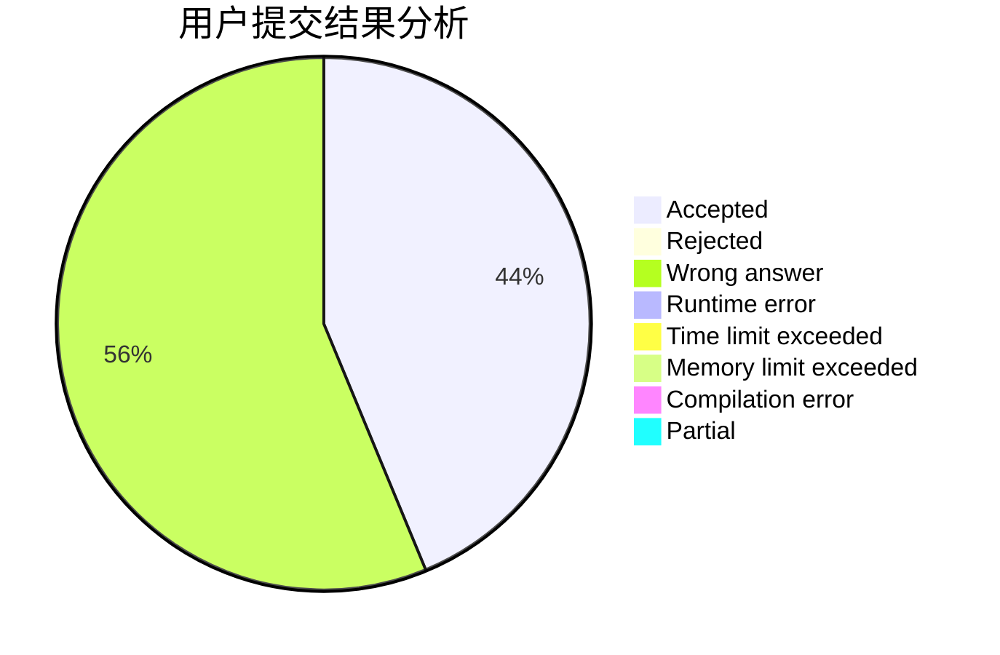
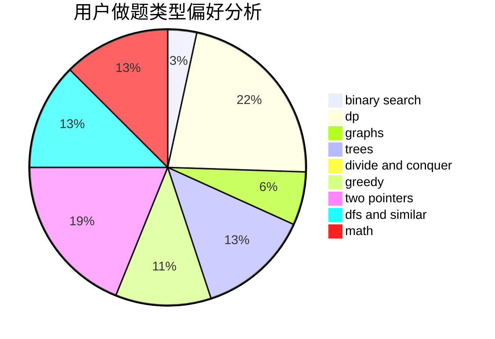

# js_xudongxin

<!-- tabs:start -->

#### **用户提交结果分析**

#### **用户做题类型偏好分析**

<!-- tabs:end -->
# 推荐题目
[1469E](https://codeforces.com/contest/1469/problem/E)
[701C](https://codeforces.com/contest/701/problem/C)
[1068C](https://codeforces.com/contest/1068/problem/C)
[1243A](https://codeforces.com/contest/1243/problem/A)
[914H](https://codeforces.com/contest/914/problem/H)
[732B](https://codeforces.com/contest/732/problem/B)
[2A](https://codeforces.com/contest/2/problem/A)
[877B](https://codeforces.com/contest/877/problem/B)
[746C](https://codeforces.com/contest/746/problem/C)
[279D](https://codeforces.com/contest/279/problem/D)
