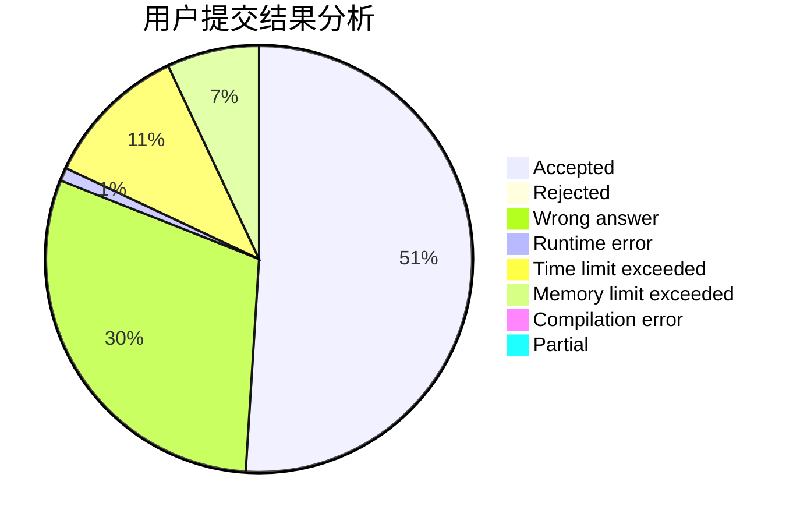
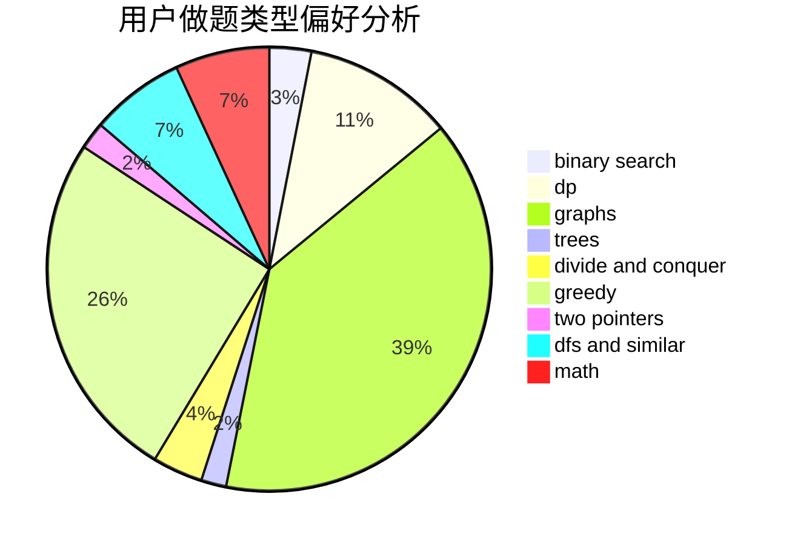

# juju527

<!-- tabs:start -->

#### **用户提交结果分析**

#### **用户做题类型偏好分析**

<!-- tabs:end -->
# 推荐题目
[1016D](https://codeforces.com/contest/1016/problem/D)
[3912](https://codeforces.com/contest/391/problem/2)
[1315D](https://codeforces.com/contest/1315/problem/D)
[157B](https://codeforces.com/contest/157/problem/B)
[737C](https://codeforces.com/contest/737/problem/C)
[787D](https://codeforces.com/contest/787/problem/D)
[730E](https://codeforces.com/contest/730/problem/E)
[122A](https://codeforces.com/contest/122/problem/A)
[14E](https://codeforces.com/contest/14/problem/E)
[1144A](https://codeforces.com/contest/1144/problem/A)
