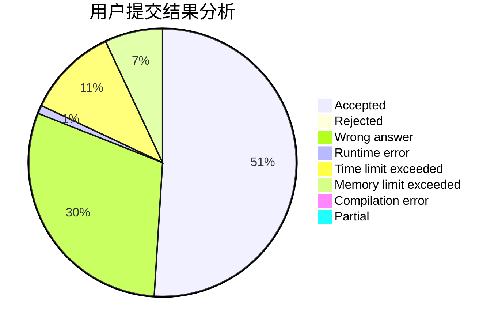
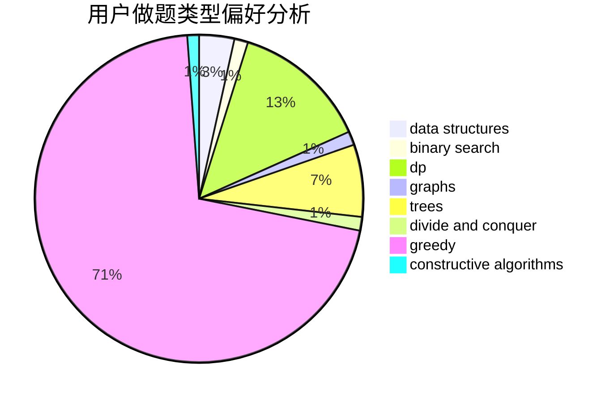

# juju527

<!-- tabs:start -->

#### **用户提交结果分析**

#### **用户做题类型偏好分析**

#### **用户错题知识点分析**

<!-- tabs:end -->
# 推荐题目
[1016A](https://codeforces.com/contest/1016/problem/A)		greedy,
                        implementation,
                        math		  
[364C](https://codeforces.com/contest/364/problem/C)		brute force,
                        number theory		  
[1307C](https://codeforces.com/contest/1307/problem/C)		brute force,
                        dp,
                        math,
                        strings		  
[1506A](https://codeforces.com/contest/1506/problem/A)		math		  
[720C](https://codeforces.com/contest/720/problem/C)		constructive algorithms		  
[768A](https://codeforces.com/contest/768/problem/A)		constructive algorithms,
                        sortings		  
[710B](https://codeforces.com/contest/710/problem/B)		brute force,
                        sortings		  
[1221E](https://codeforces.com/contest/1221/problem/E)		games		  
[1491H](https://codeforces.com/contest/1491/problem/H)		data structures,
                        trees		  
[1141F2](https://codeforces.com/contest/1141F/problem/2)		data structures,
                        greedy		  
