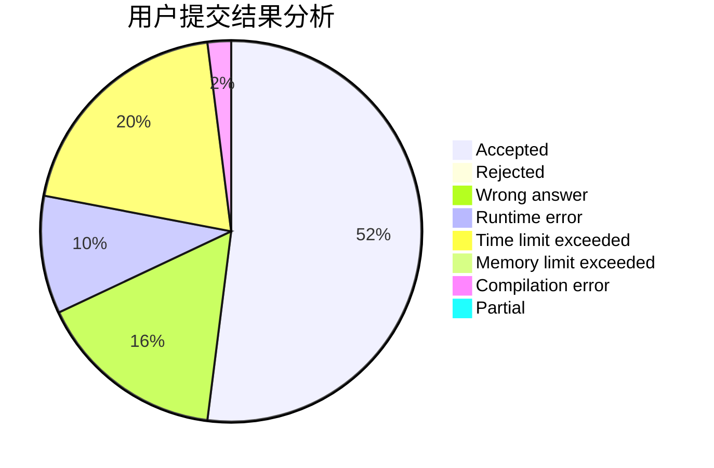
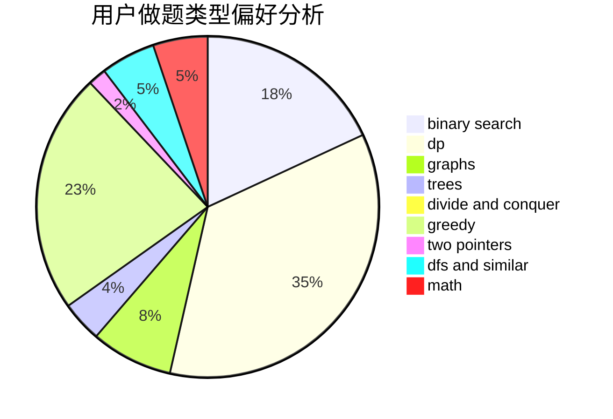

# junble19768

<!-- tabs:start -->

#### **用户提交结果分析**

#### **用户做题类型偏好分析**

<!-- tabs:end -->
# 推荐题目
[1426C](https://codeforces.com/contest/1426/problem/C)
[1445D](https://codeforces.com/contest/1445/problem/D)
[809D](https://codeforces.com/contest/809/problem/D)
[963C](https://codeforces.com/contest/963/problem/C)
[843A](https://codeforces.com/contest/843/problem/A)
[26D](https://codeforces.com/contest/26/problem/D)
[359C](https://codeforces.com/contest/359/problem/C)
[508A](https://codeforces.com/contest/508/problem/A)
[1153C](https://codeforces.com/contest/1153/problem/C)
[785D](https://codeforces.com/contest/785/problem/D)
