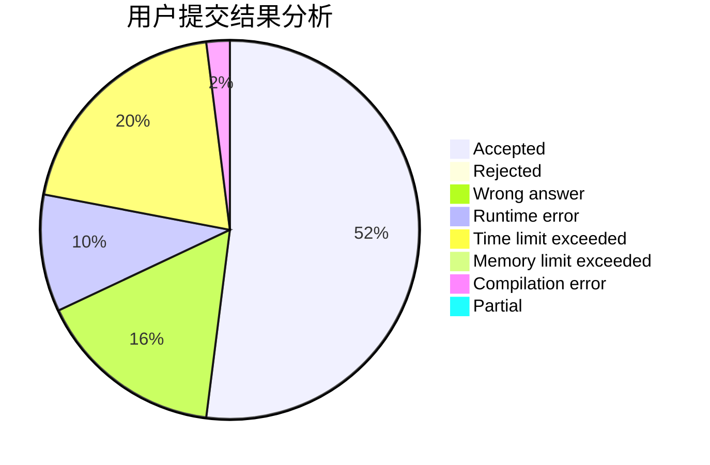
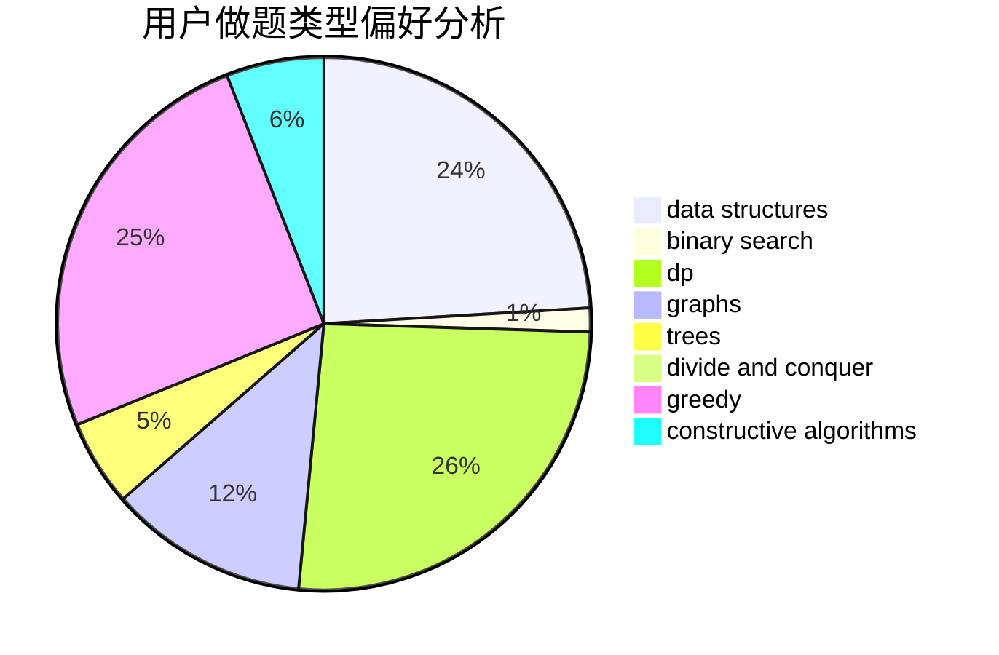
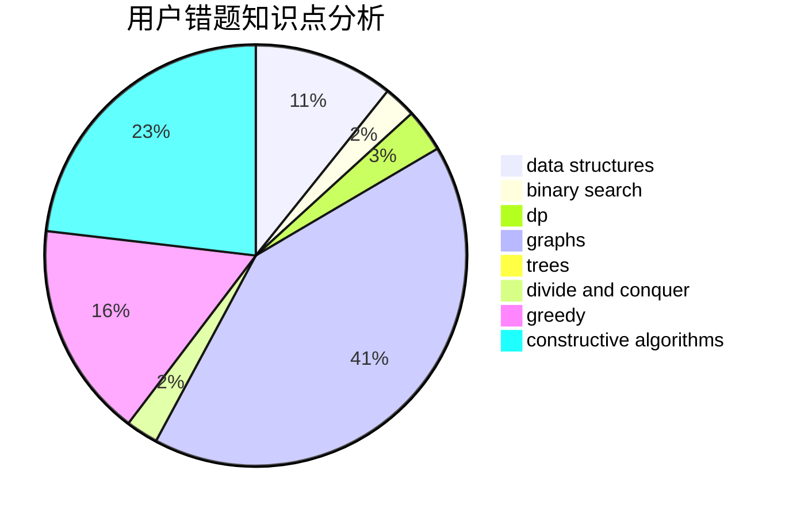

# junble19768

<!-- tabs:start -->

#### **用户提交结果分析**

#### **用户做题类型偏好分析**

#### **用户错题知识点分析**

<!-- tabs:end -->
# 推荐题目
[1418F](https://codeforces.com/contest/1418/problem/F)		data structures,
                        math,
                        number theory,
                        two pointers		  
[1435D](https://codeforces.com/contest/1435/problem/D)		dsu,graphs,sortings,trees		  
[794C](https://codeforces.com/contest/794/problem/C)		games,
                        greedy,
                        sortings		  
[946F](https://codeforces.com/contest/946/problem/F)		combinatorics,
                        dp,
                        matrices		  
[825A](https://codeforces.com/contest/825/problem/A)		implementation		  
[253A](https://codeforces.com/contest/253/problem/A)		greedy		  
[331C3](https://codeforces.com/contest/331C/problem/3)		dp		  
[487A](https://codeforces.com/contest/487/problem/A)		binary search,
                        brute force,
                        implementation		  
[1151C](https://codeforces.com/contest/1151/problem/C)		constructive algorithms,
                        math		  
[766B](https://codeforces.com/contest/766/problem/B)		constructive algorithms,
                        geometry,
                        greedy,
                        math,
                        number theory,
                        sortings		  
