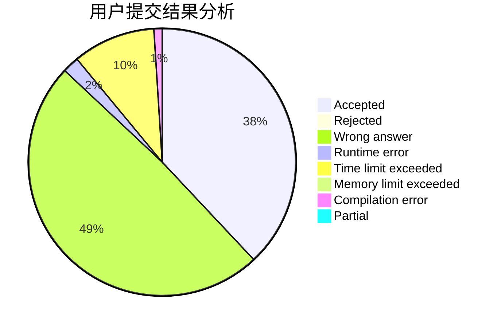
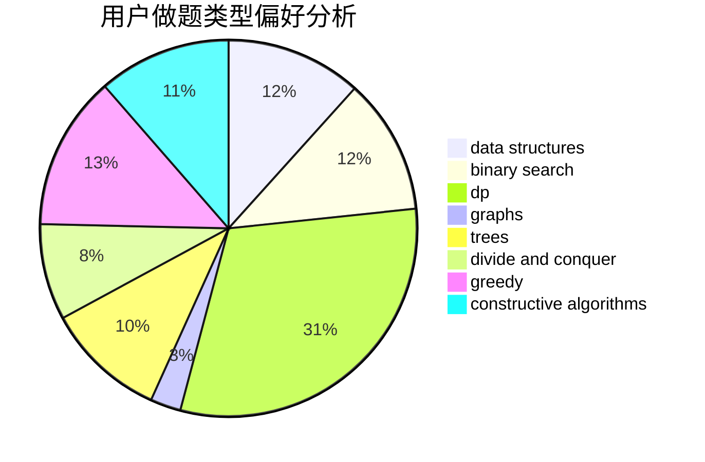
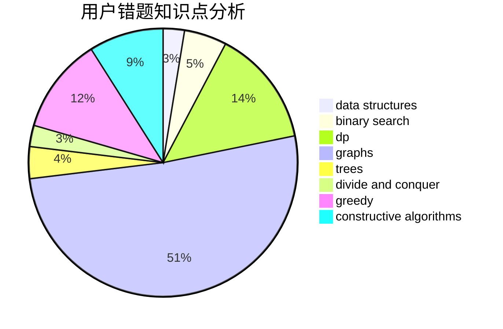

# BelowLuminous

<!-- tabs:start -->

#### **用户提交结果分析**

#### **用户做题类型偏好分析**

#### **用户错题知识点分析**

<!-- tabs:end -->
# 推荐题目
[543E](https://codeforces.com/contest/543/problem/E)		constructive algorithms,
                        data structures		  
[1413D](https://codeforces.com/contest/1413/problem/D)		data structures,
                        greedy,
                        implementation		  
[544C](https://codeforces.com/contest/544/problem/C)		dsu,graphs,sortings,trees		  
[543C](https://codeforces.com/contest/543/problem/C)		bitmasks,
                        dp		  
[1394E](https://codeforces.com/contest/1394/problem/E)		strings		  
[1471F](https://codeforces.com/contest/1471/problem/F)		dsu,graphs,sortings,trees		  
[544D](https://codeforces.com/contest/544/problem/D)		dsu,graphs,sortings,trees		  
[315A](https://codeforces.com/contest/315/problem/A)		brute force		  
[1023A](https://codeforces.com/contest/1023/problem/A)		brute force,
                        implementation,
                        strings		  
[1361E](https://codeforces.com/contest/1361/problem/E)		dfs and similar,
                        graphs,
                        probabilities,
                        trees		  
