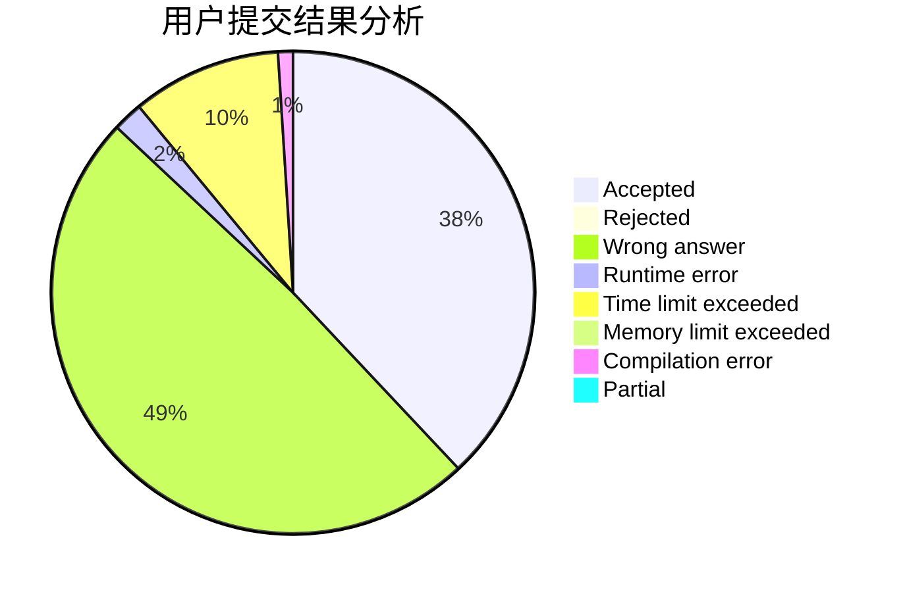
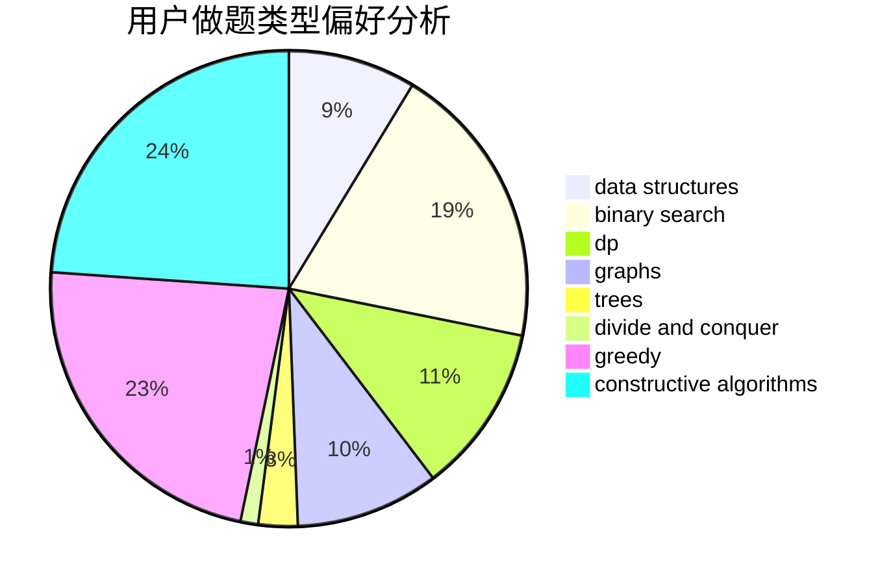
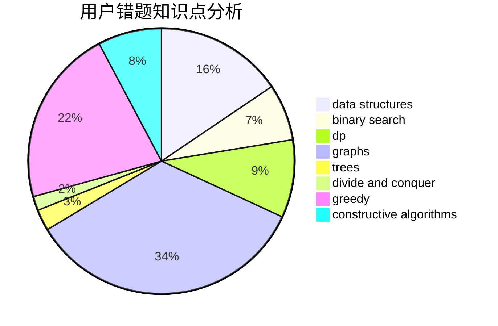

# BelowLuminous

<!-- tabs:start -->

#### **用户提交结果分析**

#### **用户做题类型偏好分析**

#### **用户错题知识点分析**

<!-- tabs:end -->
# 推荐题目
[516E](https://codeforces.com/contest/516/problem/E)		math,
                        number theory		  
[1402B](https://codeforces.com/contest/1402/problem/B)		*special problem,
                        geometry,
                        sortings		  
[518F](https://codeforces.com/contest/518/problem/F)		binary search,
                        brute force,
                        combinatorics,
                        dp,
                        implementation		  
[516C](https://codeforces.com/contest/516/problem/C)		dsu,graphs,sortings,trees		  
[1384E](https://codeforces.com/contest/1384/problem/E)		dsu,graphs,sortings,trees		  
[1464E](https://codeforces.com/contest/1464/problem/E)		dsu,graphs,sortings,trees		  
[519B](https://codeforces.com/contest/519/problem/B)		data structures,
                        implementation,
                        sortings		  
[297E](https://codeforces.com/contest/297/problem/E)		data structures		  
[1020C](https://codeforces.com/contest/1020/problem/C)		dsu,graphs,sortings,trees		  
[1355A](https://codeforces.com/contest/1355/problem/A)		brute force,
                        implementation,
                        math		  
