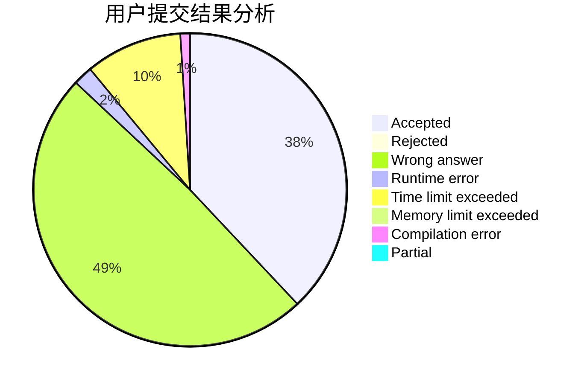
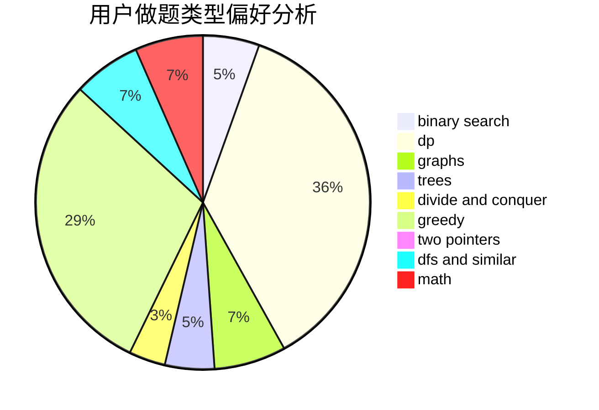

# BelowLuminous

<!-- tabs:start -->

#### **用户提交结果分析**

#### **用户做题类型偏好分析**

<!-- tabs:end -->
# 推荐题目
[543E](https://codeforces.com/contest/543/problem/E)
[1413D](https://codeforces.com/contest/1413/problem/D)
[544C](https://codeforces.com/contest/544/problem/C)
[543C](https://codeforces.com/contest/543/problem/C)
[1394E](https://codeforces.com/contest/1394/problem/E)
[1471F](https://codeforces.com/contest/1471/problem/F)
[544D](https://codeforces.com/contest/544/problem/D)
[315A](https://codeforces.com/contest/315/problem/A)
[1023A](https://codeforces.com/contest/1023/problem/A)
[1361E](https://codeforces.com/contest/1361/problem/E)
