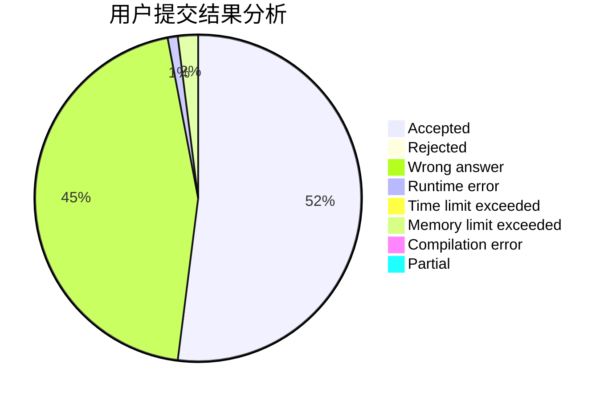
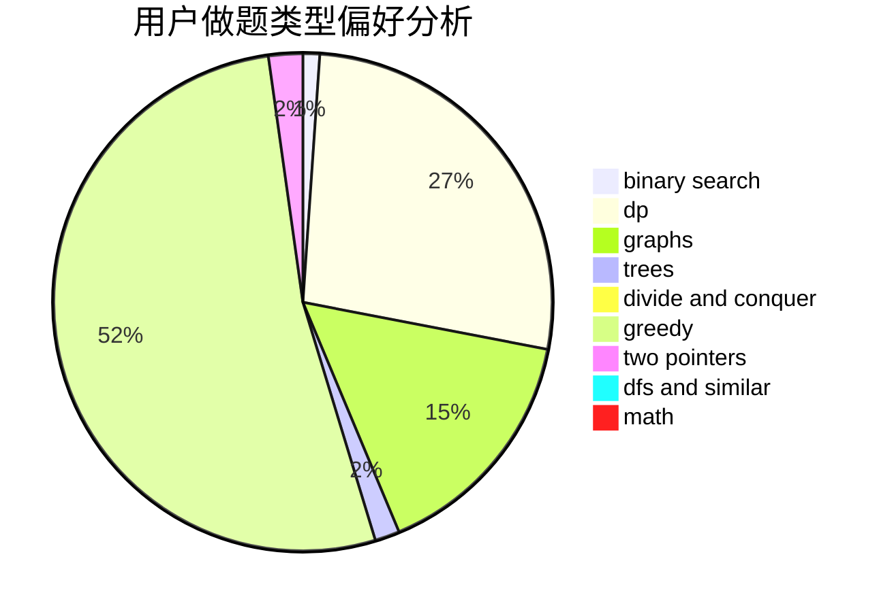

# jurao

<!-- tabs:start -->

#### **用户提交结果分析**

#### **用户做题类型偏好分析**

<!-- tabs:end -->
# 推荐题目
[1039B](https://codeforces.com/contest/1039/problem/B)
[567A](https://codeforces.com/contest/567/problem/A)
[288E](https://codeforces.com/contest/288/problem/E)
[1033A](https://codeforces.com/contest/1033/problem/A)
[889E](https://codeforces.com/contest/889/problem/E)
[865G](https://codeforces.com/contest/865/problem/G)
[1140B](https://codeforces.com/contest/1140/problem/B)
[749A](https://codeforces.com/contest/749/problem/A)
[125E](https://codeforces.com/contest/125/problem/E)
[680A](https://codeforces.com/contest/680/problem/A)
