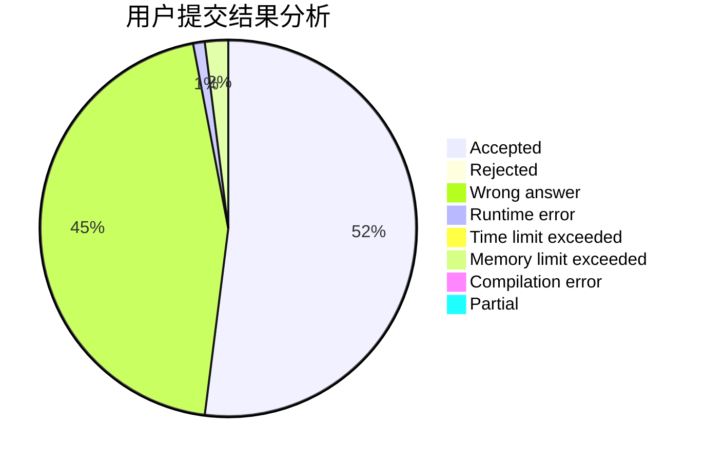
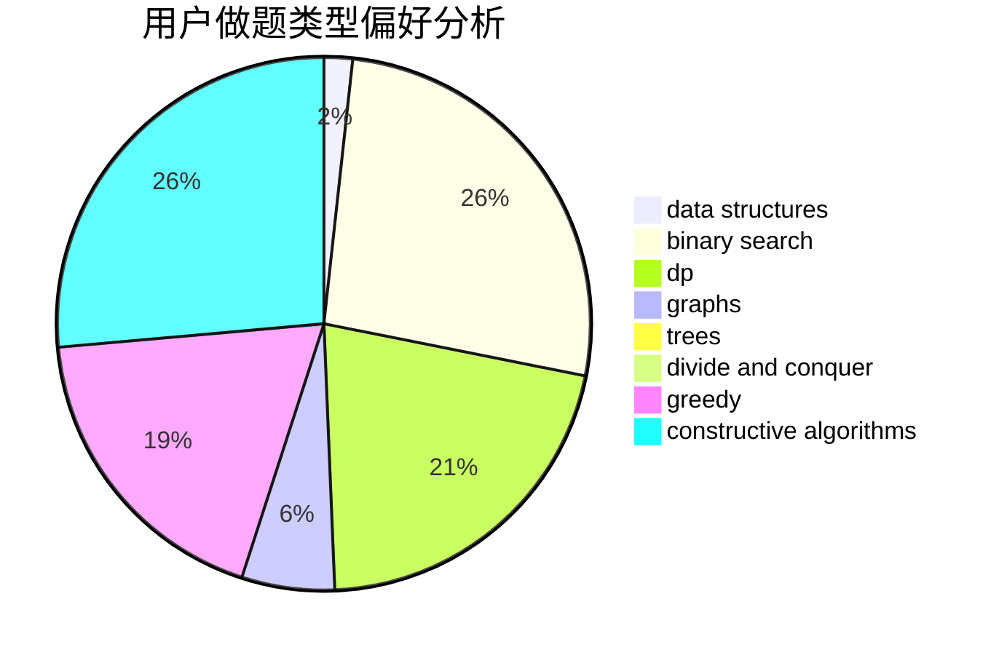
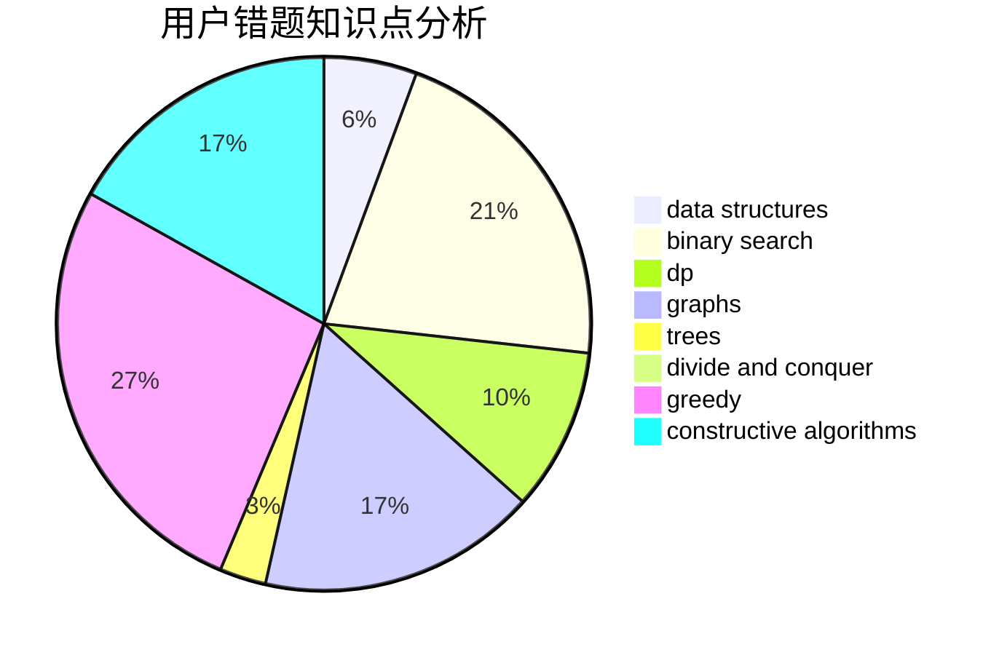

# jurao

<!-- tabs:start -->

#### **用户提交结果分析**

#### **用户做题类型偏好分析**

#### **用户错题知识点分析**

<!-- tabs:end -->
# 推荐题目
[1038D](https://codeforces.com/contest/1038/problem/D)		dp,
                        greedy,
                        implementation		  
[542E](https://codeforces.com/contest/542/problem/E)		graphs,
                        shortest paths		  
[272E](https://codeforces.com/contest/272/problem/E)		combinatorics,
                        constructive algorithms,
                        graphs		  
[1032D](https://codeforces.com/contest/1032/problem/D)		geometry,
                        implementation		  
[86B](https://codeforces.com/contest/86/problem/B)		constructive algorithms,
                        graph matchings,
                        greedy,
                        math		  
[847F](https://codeforces.com/contest/847/problem/F)		greedy,
                        sortings		  
[1138D](https://codeforces.com/contest/1138/problem/D)		dsu,graphs,sortings,trees		  
[730J](https://codeforces.com/contest/730/problem/J)		dp		  
[1252J](https://codeforces.com/contest/1252/problem/J)		brute force,
                        dp		  
[65A](https://codeforces.com/contest/65/problem/A)		implementation,
                        math		  
