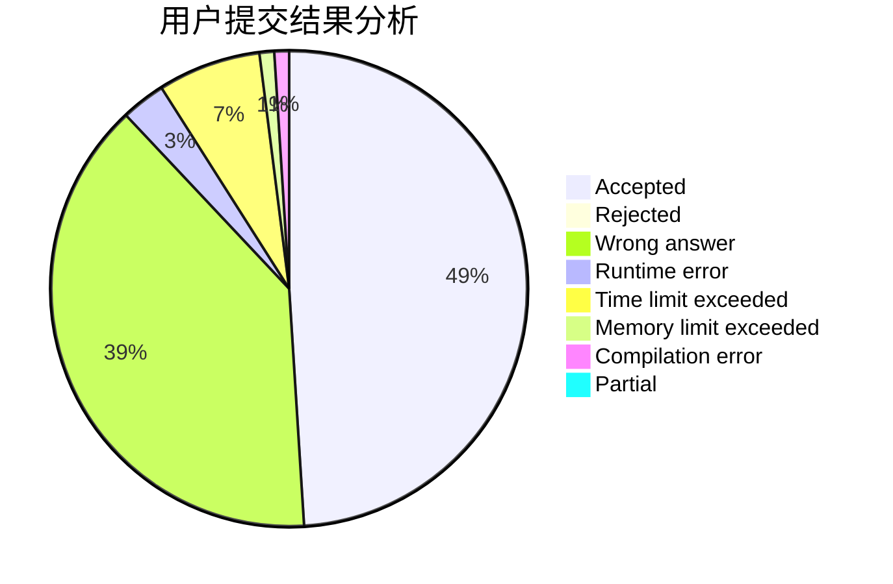
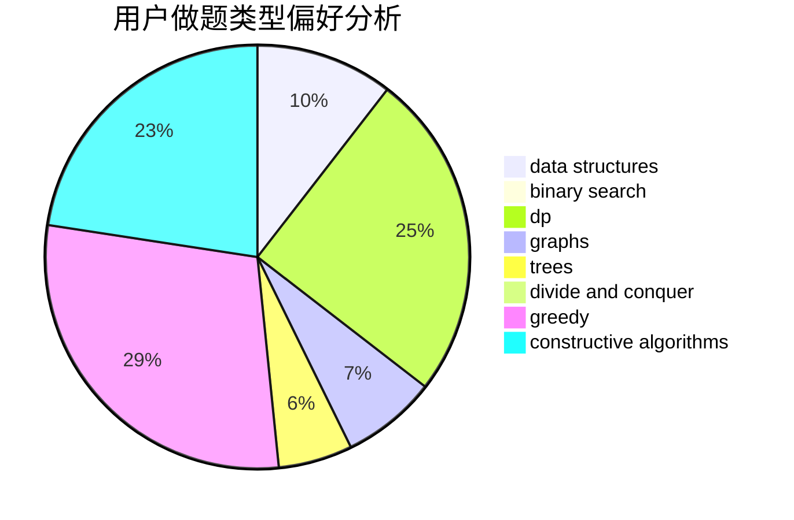
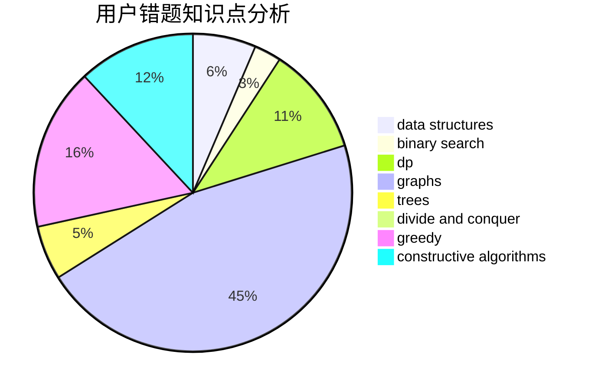

# juraws

<!-- tabs:start -->

#### **用户提交结果分析**

#### **用户做题类型偏好分析**

#### **用户错题知识点分析**

<!-- tabs:end -->
# 推荐题目
[1408D](https://codeforces.com/contest/1408/problem/D)		binary search,
                        brute force,
                        data structures,
                        dp,
                        implementation,
                        sortings,
                        two pointers		  
[896A](https://codeforces.com/contest/896/problem/A)		binary search,
                        dfs and similar		  
[543C](https://codeforces.com/contest/543/problem/C)		bitmasks,
                        dp		  
[282A](https://codeforces.com/contest/282/problem/A)		implementation		  
[1269D](https://codeforces.com/contest/1269/problem/D)		dsu,graphs,sortings,trees		  
[462A](https://codeforces.com/contest/462/problem/A)		brute force,
                        implementation		  
[13781](https://codeforces.com/contest/1378/problem/1)		dsu,graphs,sortings,trees		  
[107A](https://codeforces.com/contest/107/problem/A)		dfs and similar,
                        graphs		  
[798A](https://codeforces.com/contest/798/problem/A)		brute force,
                        constructive algorithms,
                        strings		  
[1110D](https://codeforces.com/contest/1110/problem/D)		dp		  
