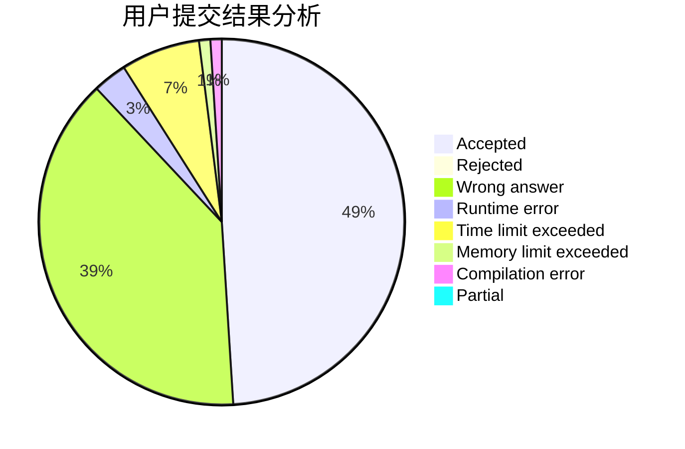
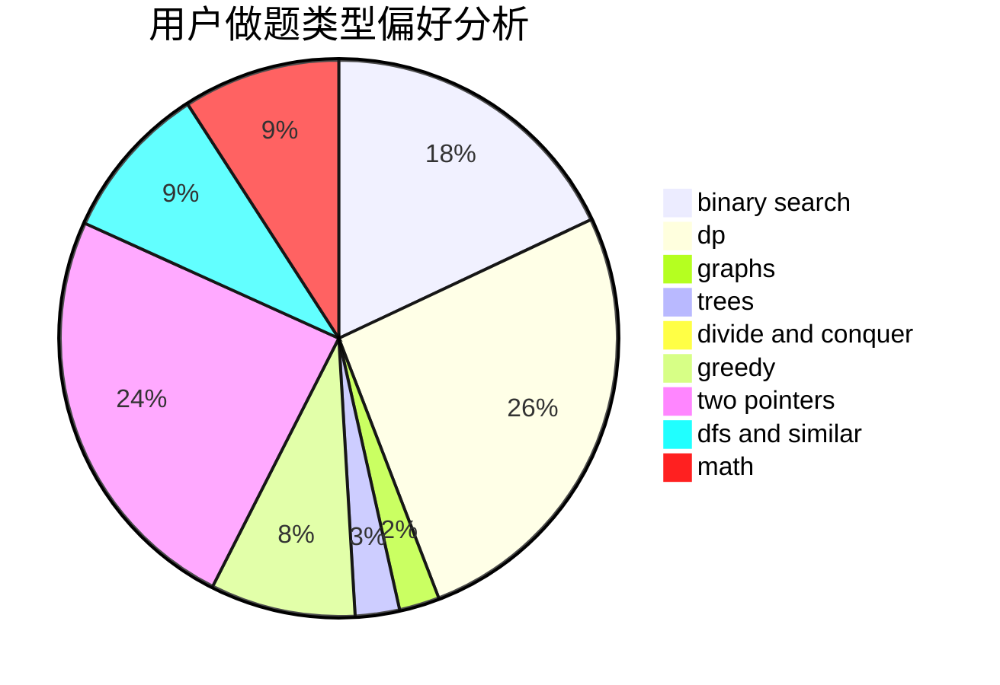

# juraws

<!-- tabs:start -->

#### **用户提交结果分析**

#### **用户做题类型偏好分析**

<!-- tabs:end -->
# 推荐题目
[1408D](https://codeforces.com/contest/1408/problem/D)
[896A](https://codeforces.com/contest/896/problem/A)
[543C](https://codeforces.com/contest/543/problem/C)
[282A](https://codeforces.com/contest/282/problem/A)
[1269D](https://codeforces.com/contest/1269/problem/D)
[462A](https://codeforces.com/contest/462/problem/A)
[13781](https://codeforces.com/contest/1378/problem/1)
[107A](https://codeforces.com/contest/107/problem/A)
[798A](https://codeforces.com/contest/798/problem/A)
[1110D](https://codeforces.com/contest/1110/problem/D)
