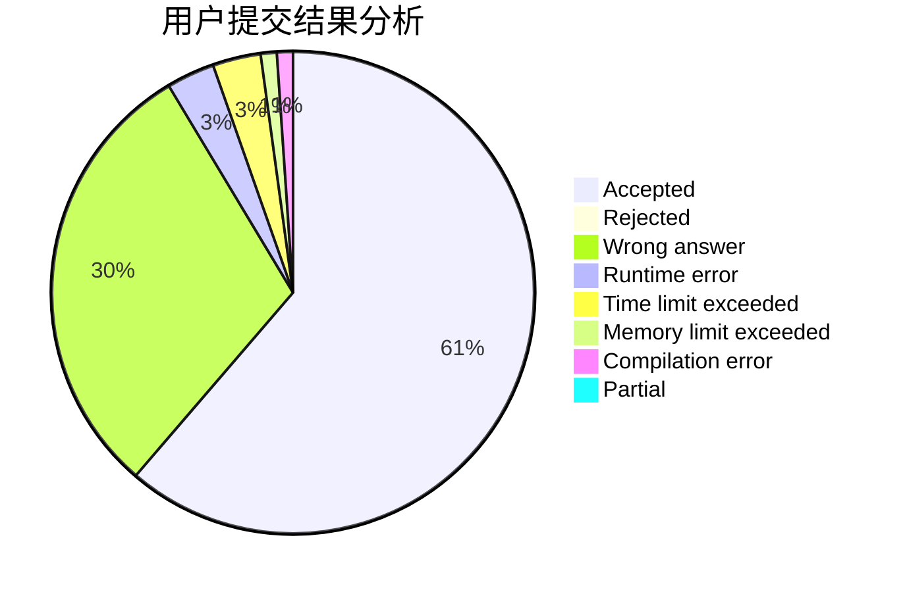
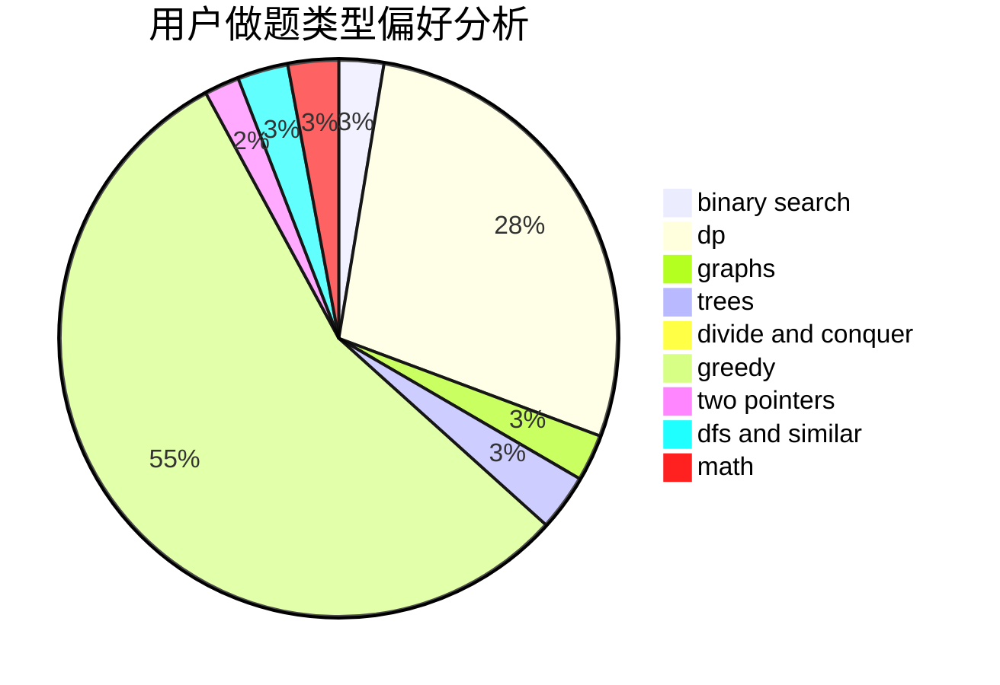

# juruo1086

<!-- tabs:start -->

#### **用户提交结果分析**

#### **用户做题类型偏好分析**

<!-- tabs:end -->
# 推荐题目
[1270A](https://codeforces.com/contest/1270/problem/A)
[1413C](https://codeforces.com/contest/1413/problem/C)
[928B](https://codeforces.com/contest/928/problem/B)
[519E](https://codeforces.com/contest/519/problem/E)
[339A](https://codeforces.com/contest/339/problem/A)
[1000B](https://codeforces.com/contest/1000/problem/B)
[868A](https://codeforces.com/contest/868/problem/A)
[515E](https://codeforces.com/contest/515/problem/E)
[507E](https://codeforces.com/contest/507/problem/E)
[508C](https://codeforces.com/contest/508/problem/C)
