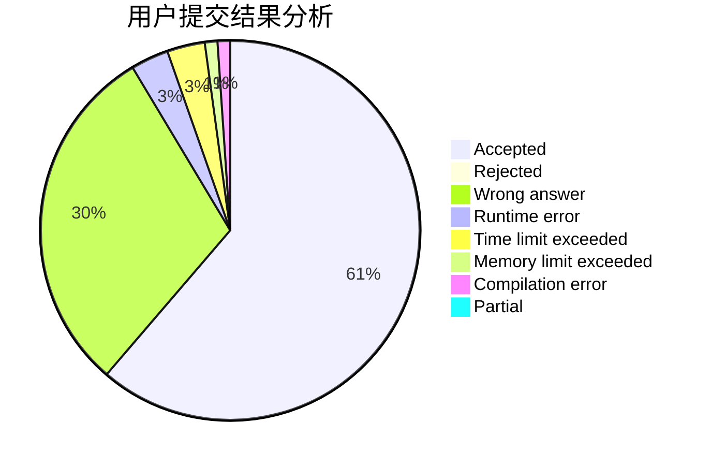
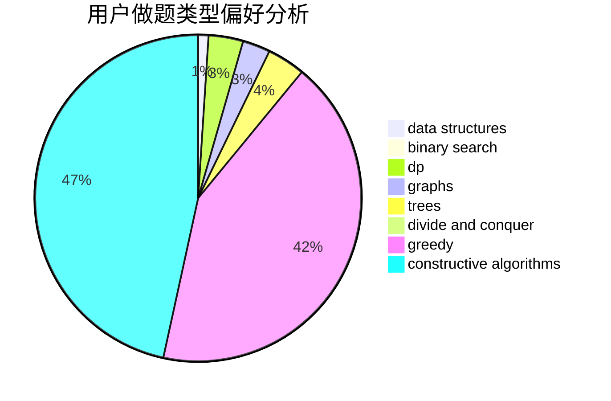
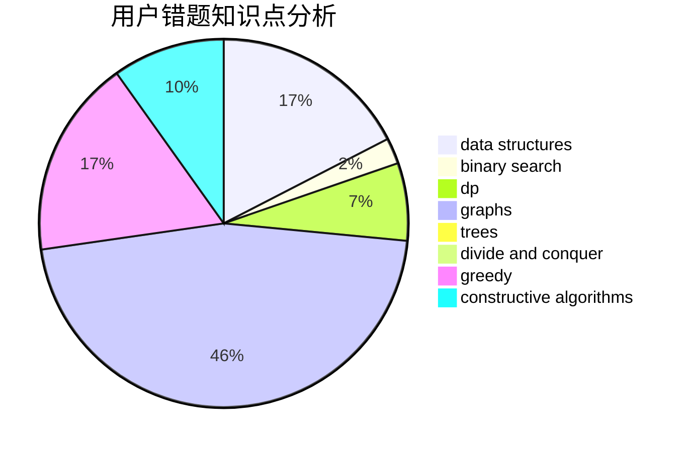

# juruo1086

<!-- tabs:start -->

#### **用户提交结果分析**

#### **用户做题类型偏好分析**

#### **用户错题知识点分析**

<!-- tabs:end -->
# 推荐题目
[1270A](https://codeforces.com/contest/1270/problem/A)		games,
                        greedy,
                        math		  
[1413C](https://codeforces.com/contest/1413/problem/C)		binary search,
                        brute force,
                        dp,
                        implementation,
                        sortings,
                        two pointers		  
[928B](https://codeforces.com/contest/928/problem/B)		*special problem,
                        dp		  
[519E](https://codeforces.com/contest/519/problem/E)		binary search,
                        data structures,
                        dfs and similar,
                        dp,
                        trees		  
[339A](https://codeforces.com/contest/339/problem/A)		greedy,
                        implementation,
                        sortings,
                        strings		  
[1000B](https://codeforces.com/contest/1000/problem/B)		greedy		  
[868A](https://codeforces.com/contest/868/problem/A)		brute force,
                        implementation,
                        strings		  
[515E](https://codeforces.com/contest/515/problem/E)		data structures		  
[507E](https://codeforces.com/contest/507/problem/E)		dfs and similar,
                        dp,
                        graphs,
                        shortest paths		  
[508C](https://codeforces.com/contest/508/problem/C)		constructive algorithms,
                        greedy		  
