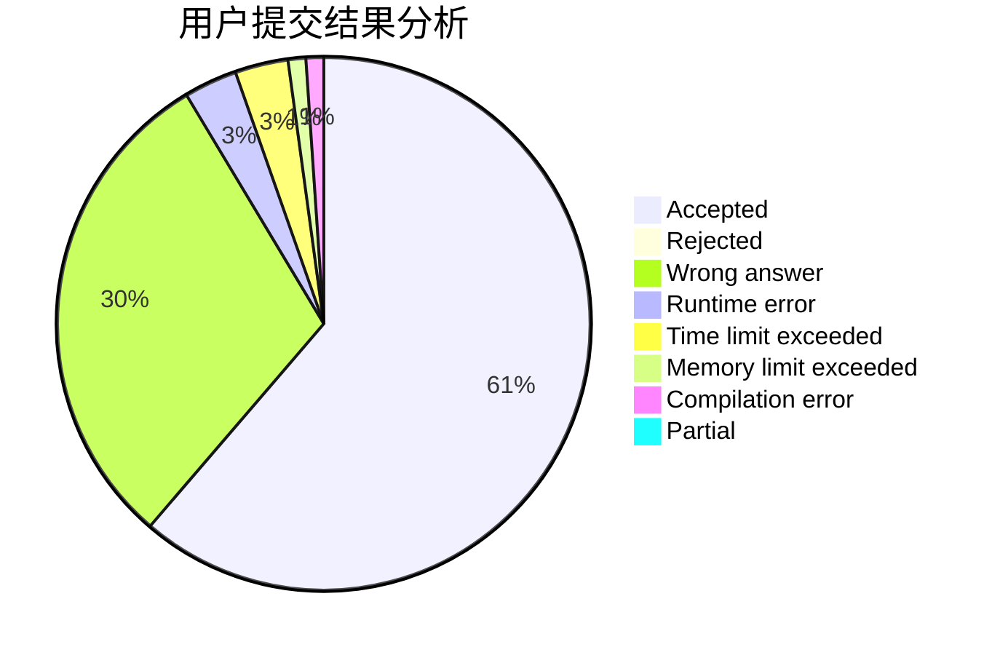
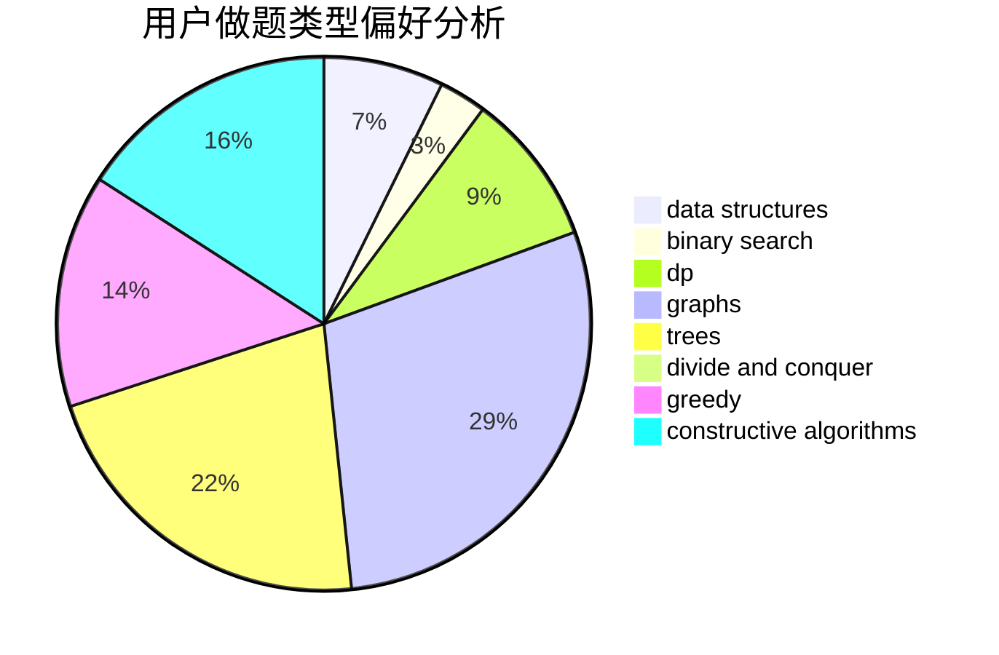
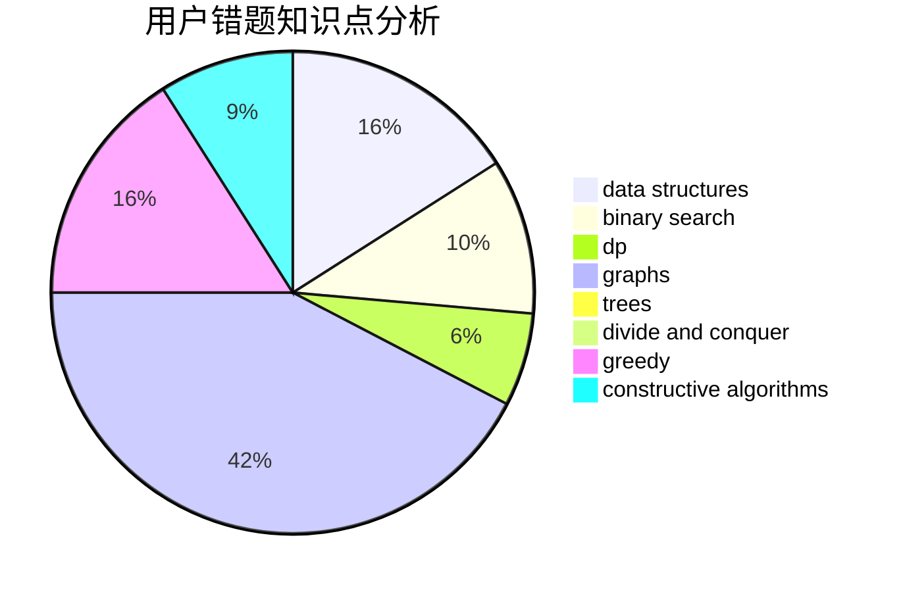

# juruo1086

<!-- tabs:start -->

#### **用户提交结果分析**

#### **用户做题类型偏好分析**

#### **用户错题知识点分析**

<!-- tabs:end -->
# 推荐题目
[1264C](https://codeforces.com/contest/1264/problem/C)		data structures,
                        probabilities		  
[1402A](https://codeforces.com/contest/1402/problem/A)		*special problem,
                        data structures,
                        dsu,
                        implementation,
                        math,
                        sortings		  
[911C](https://codeforces.com/contest/911/problem/C)		brute force,
                        constructive algorithms		  
[498E](https://codeforces.com/contest/498/problem/E)		dp,
                        matrices		  
[314B](https://codeforces.com/contest/314/problem/B)		binary search,
                        dfs and similar,
                        strings		  
[1000B](https://codeforces.com/contest/1000/problem/B)		greedy		  
[848D](https://codeforces.com/contest/848/problem/D)		combinatorics,
                        dp,
                        flows,
                        graphs		  
[496B](https://codeforces.com/contest/496/problem/B)		brute force,
                        constructive algorithms,
                        implementation		  
[486E](https://codeforces.com/contest/486/problem/E)		data structures,
                        dp,
                        greedy,
                        hashing,
                        math		  
[487C](https://codeforces.com/contest/487/problem/C)		constructive algorithms,
                        math,
                        number theory		  
