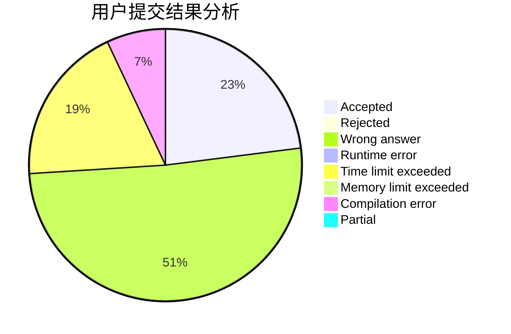
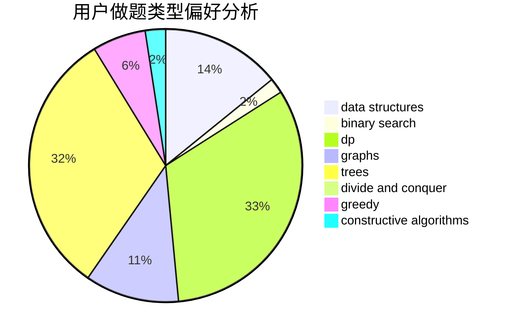
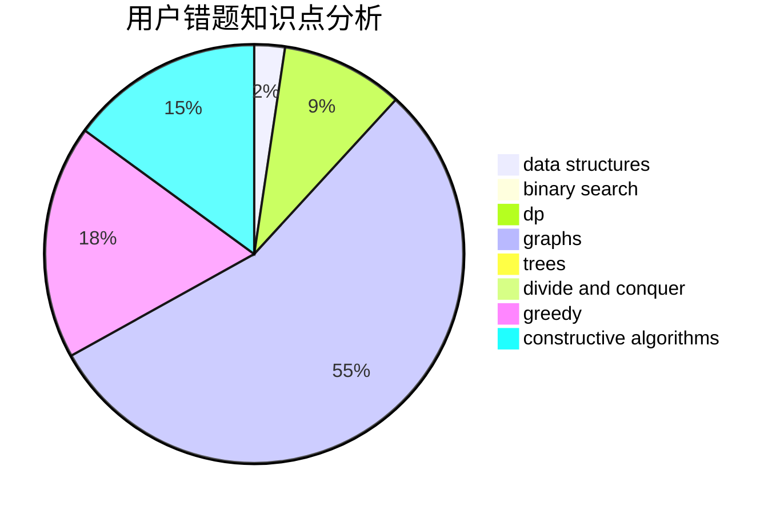

# justWriter

<!-- tabs:start -->

#### **用户提交结果分析**

#### **用户做题类型偏好分析**

#### **用户错题知识点分析**

<!-- tabs:end -->
# 推荐题目
[952D](https://codeforces.com/contest/952/problem/D)		probabilities		  
[900B](https://codeforces.com/contest/900/problem/B)		math,
                        number theory		  
[688D](https://codeforces.com/contest/688/problem/D)		dsu,graphs,sortings,trees		  
[1332G](https://codeforces.com/contest/1332/problem/G)		data structures		  
[512A](https://codeforces.com/contest/512/problem/A)		dsu,graphs,sortings,trees		  
[32A](https://codeforces.com/contest/32/problem/A)		brute force		  
[11631](https://codeforces.com/contest/1163/problem/1)		dsu,graphs,sortings,trees		  
[998A](https://codeforces.com/contest/998/problem/A)		constructive algorithms,
                        implementation		  
[1247F](https://codeforces.com/contest/1247/problem/F)		dsu,graphs,sortings,trees		  
[1154A](https://codeforces.com/contest/1154/problem/A)		math		  
