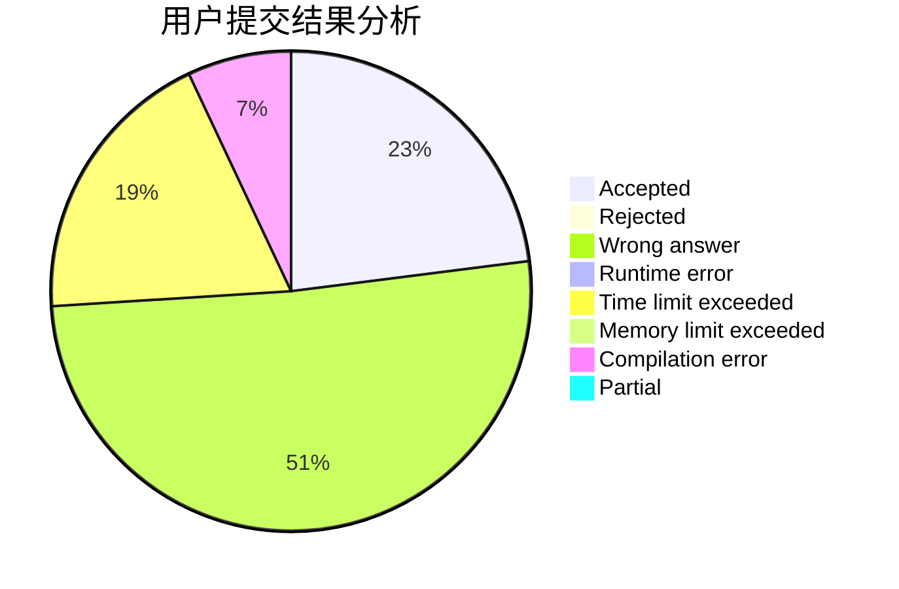
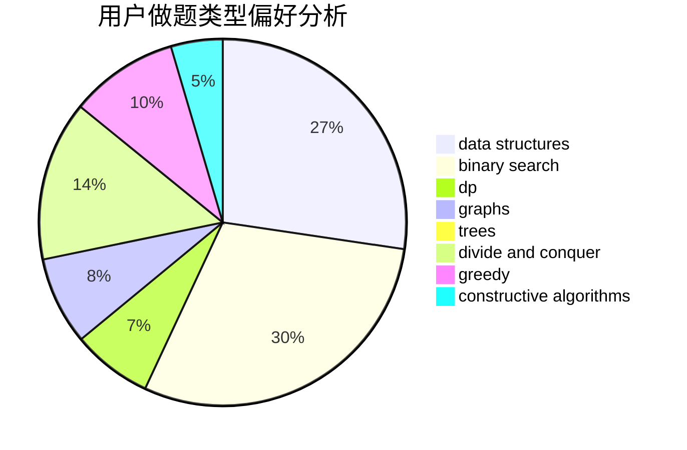
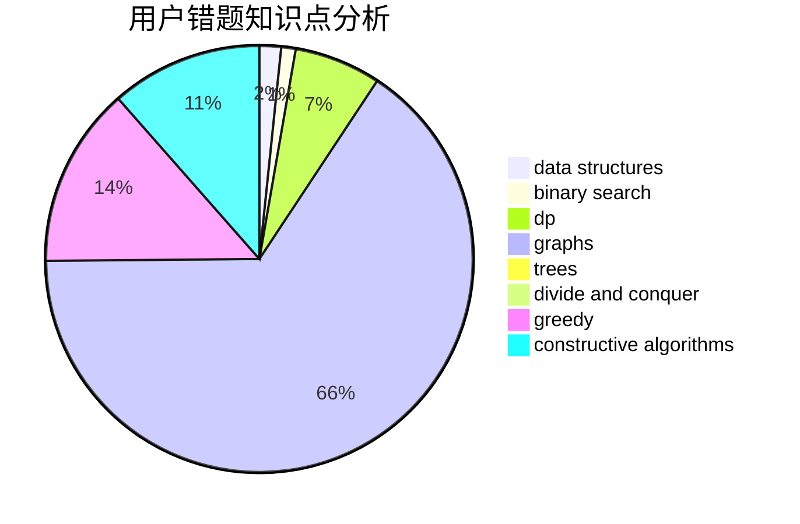

# justWriter

<!-- tabs:start -->

#### **用户提交结果分析**

#### **用户做题类型偏好分析**

#### **用户错题知识点分析**

<!-- tabs:end -->
# 推荐题目
[931D](https://codeforces.com/contest/931/problem/D)		dsu,graphs,sortings,trees		  
[883C](https://codeforces.com/contest/883/problem/C)		binary search,
                        implementation		  
[666E](https://codeforces.com/contest/666/problem/E)		data structures,
                        string suffix structures		  
[1326D2](https://codeforces.com/contest/1326D/problem/2)		binary search,
                        greedy,
                        hashing,
                        string suffix structures,
                        strings		  
[491B](https://codeforces.com/contest/491/problem/B)		greedy,
                        math		  
[309B](https://codeforces.com/contest/309/problem/B)		dp,
                        two pointers		  
[115B](https://codeforces.com/contest/115/problem/B)		greedy,
                        sortings		  
[982C](https://codeforces.com/contest/982/problem/C)		dfs and similar,
                        dp,
                        graphs,
                        greedy,
                        trees		  
[1242D](https://codeforces.com/contest/1242/problem/D)		math		  
[1152A](https://codeforces.com/contest/1152/problem/A)		greedy,
                        implementation,
                        math		  
