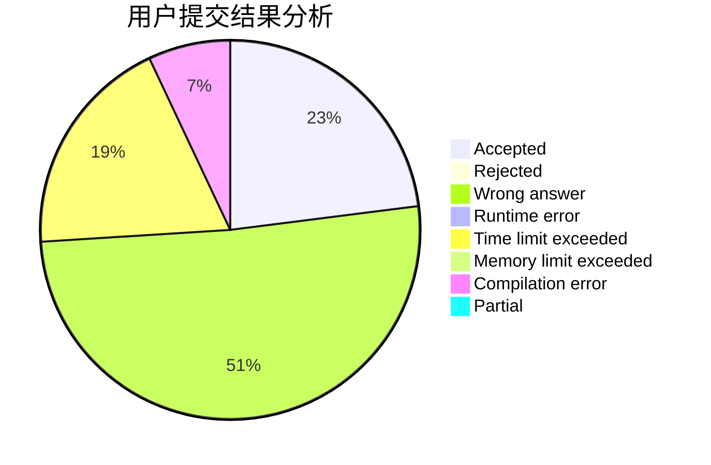
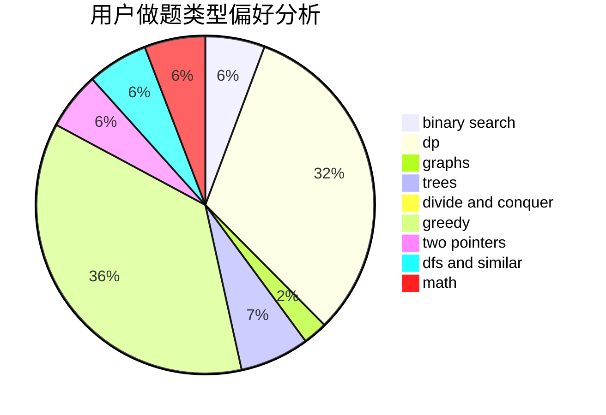

# justWriter

<!-- tabs:start -->

#### **用户提交结果分析**

#### **用户做题类型偏好分析**

<!-- tabs:end -->
# 推荐题目
[952D](https://codeforces.com/contest/952/problem/D)
[900B](https://codeforces.com/contest/900/problem/B)
[688D](https://codeforces.com/contest/688/problem/D)
[1332G](https://codeforces.com/contest/1332/problem/G)
[512A](https://codeforces.com/contest/512/problem/A)
[32A](https://codeforces.com/contest/32/problem/A)
[11631](https://codeforces.com/contest/1163/problem/1)
[998A](https://codeforces.com/contest/998/problem/A)
[1247F](https://codeforces.com/contest/1247/problem/F)
[1154A](https://codeforces.com/contest/1154/problem/A)
