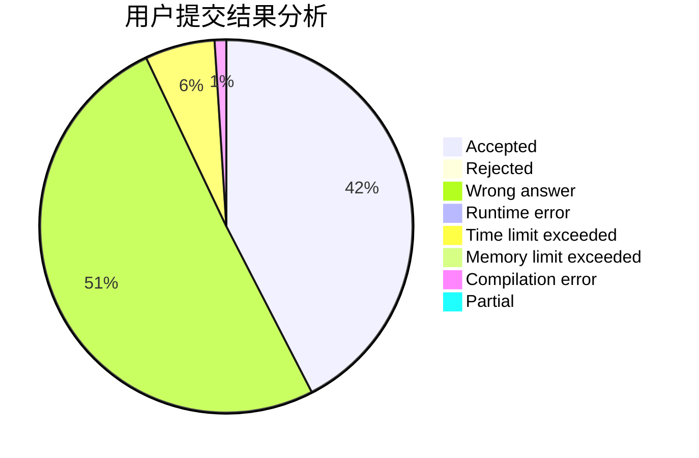
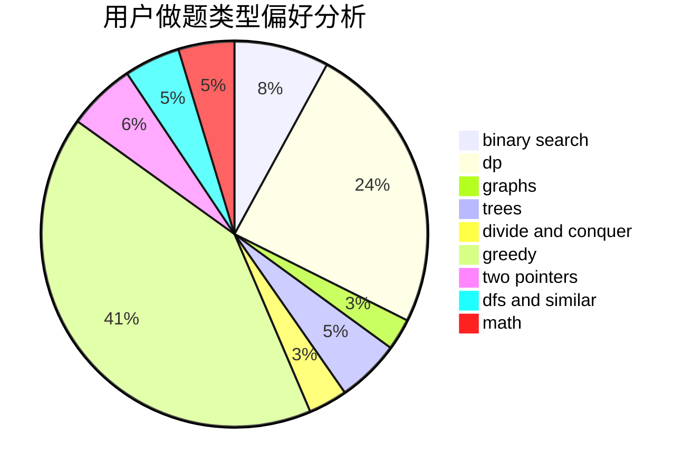

# jvruodejrLS

<!-- tabs:start -->

#### **用户提交结果分析**

#### **用户做题类型偏好分析**

<!-- tabs:end -->
# 推荐题目
[9A](https://codeforces.com/contest/9/problem/A)
[1166F](https://codeforces.com/contest/1166/problem/F)
[1169B](https://codeforces.com/contest/1169/problem/B)
[1067B](https://codeforces.com/contest/1067/problem/B)
[509C](https://codeforces.com/contest/509/problem/C)
[7A](https://codeforces.com/contest/7/problem/A)
[916B](https://codeforces.com/contest/916/problem/B)
[346E](https://codeforces.com/contest/346/problem/E)
[772C](https://codeforces.com/contest/772/problem/C)
[437A](https://codeforces.com/contest/437/problem/A)
