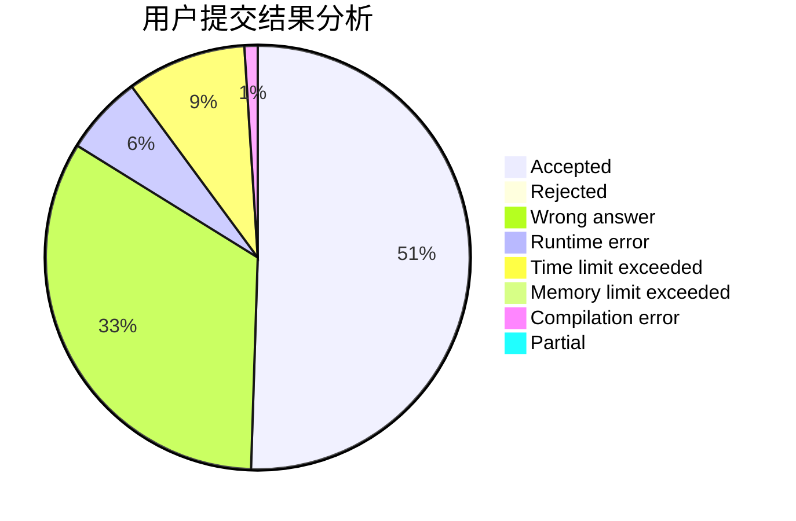
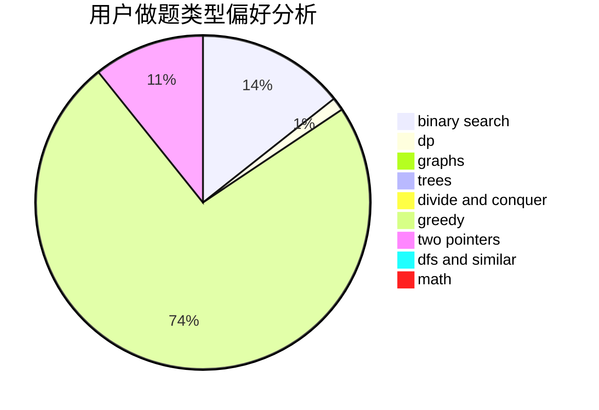

# jxm2001

<!-- tabs:start -->

#### **用户提交结果分析**

#### **用户做题类型偏好分析**

<!-- tabs:end -->
# 推荐题目
[1457B](https://codeforces.com/contest/1457/problem/B)
[364A](https://codeforces.com/contest/364/problem/A)
[61B](https://codeforces.com/contest/61/problem/B)
[1280A](https://codeforces.com/contest/1280/problem/A)
[746A](https://codeforces.com/contest/746/problem/A)
[989D](https://codeforces.com/contest/989/problem/D)
[1040B](https://codeforces.com/contest/1040/problem/B)
[11732](https://codeforces.com/contest/1173/problem/2)
[877F](https://codeforces.com/contest/877/problem/F)
[1064E](https://codeforces.com/contest/1064/problem/E)
