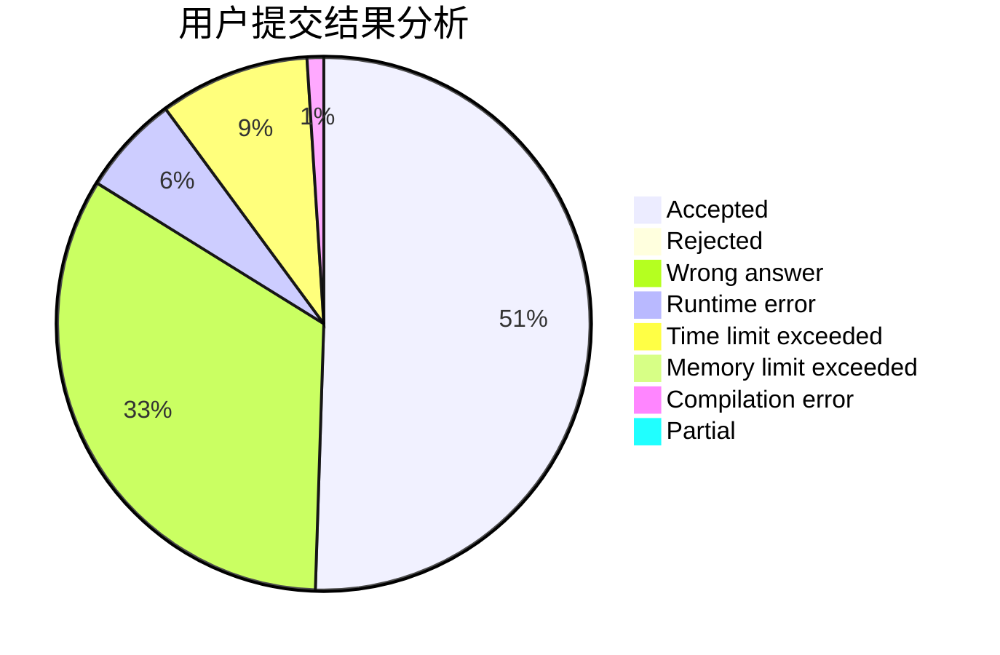
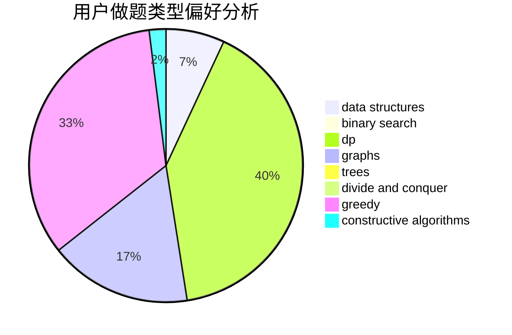
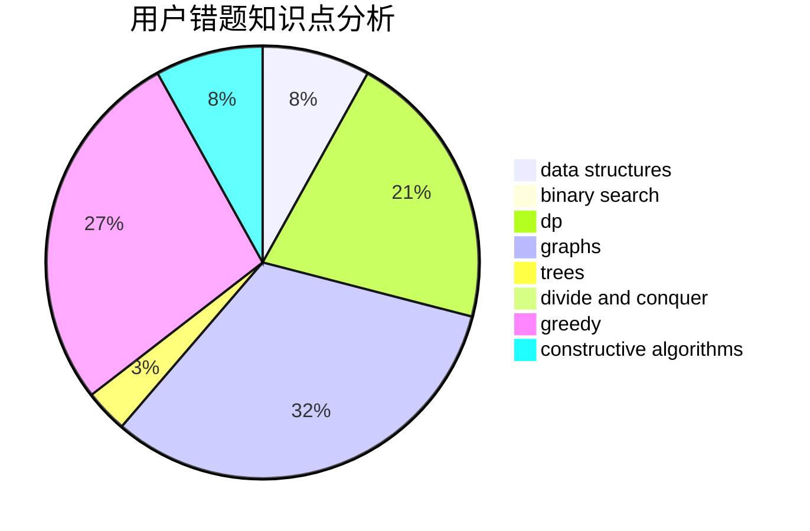

# jxm2001

<!-- tabs:start -->

#### **用户提交结果分析**

#### **用户做题类型偏好分析**

#### **用户错题知识点分析**

<!-- tabs:end -->
# 推荐题目
[1447E](https://codeforces.com/contest/1447/problem/E)		dsu,graphs,sortings,trees		  
[337C](https://codeforces.com/contest/337/problem/C)		binary search,
                        greedy,
                        math,
                        matrices,
                        number theory		  
[600C](https://codeforces.com/contest/600/problem/C)		constructive algorithms,
                        greedy,
                        strings		  
[1270H](https://codeforces.com/contest/1270/problem/H)		data structures		  
[729A](https://codeforces.com/contest/729/problem/A)		implementation,
                        strings		  
[96B](https://codeforces.com/contest/96/problem/B)		binary search,
                        bitmasks,
                        brute force		  
[103D](https://codeforces.com/contest/103/problem/D)		brute force,
                        data structures,
                        sortings		  
[1168C](https://codeforces.com/contest/1168/problem/C)		bitmasks,
                        dp		  
[85E](https://codeforces.com/contest/85/problem/E)		binary search,
                        dsu,
                        geometry,
                        graphs,
                        sortings		  
[1064B](https://codeforces.com/contest/1064/problem/B)		math		  
