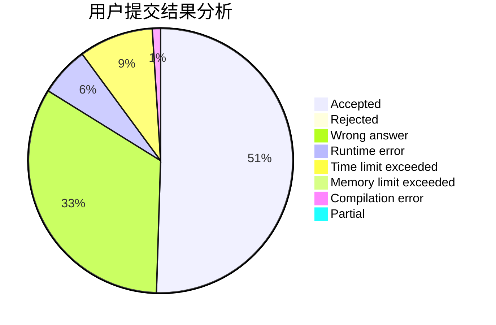
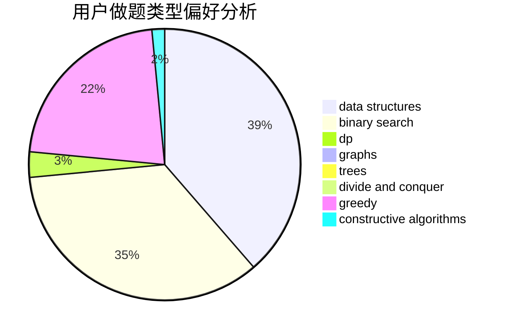

# jxm2001

<!-- tabs:start -->

#### **用户提交结果分析**

#### **用户做题类型偏好分析**

#### **用户错题知识点分析**

<!-- tabs:end -->
# 推荐题目
[1457B](https://codeforces.com/contest/1457/problem/B)		dsu,graphs,sortings,trees		  
[364A](https://codeforces.com/contest/364/problem/A)		combinatorics,
                        data structures,
                        implementation		  
[61B](https://codeforces.com/contest/61/problem/B)		strings		  
[1280A](https://codeforces.com/contest/1280/problem/A)		implementation,
                        math		  
[746A](https://codeforces.com/contest/746/problem/A)		implementation,
                        math		  
[989D](https://codeforces.com/contest/989/problem/D)		binary search,
                        geometry,
                        math,
                        sortings,
                        two pointers		  
[1040B](https://codeforces.com/contest/1040/problem/B)		dp,
                        greedy,
                        math		  
[11732](https://codeforces.com/contest/1173/problem/2)		dsu,graphs,sortings,trees		  
[877F](https://codeforces.com/contest/877/problem/F)		data structures,
                        flows,
                        hashing		  
[1064E](https://codeforces.com/contest/1064/problem/E)		dsu,graphs,sortings,trees		  
