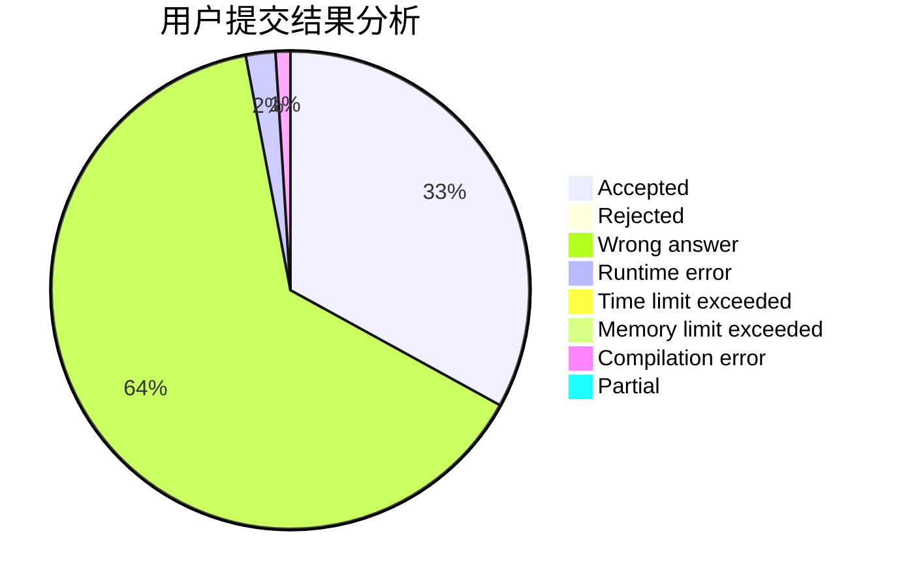
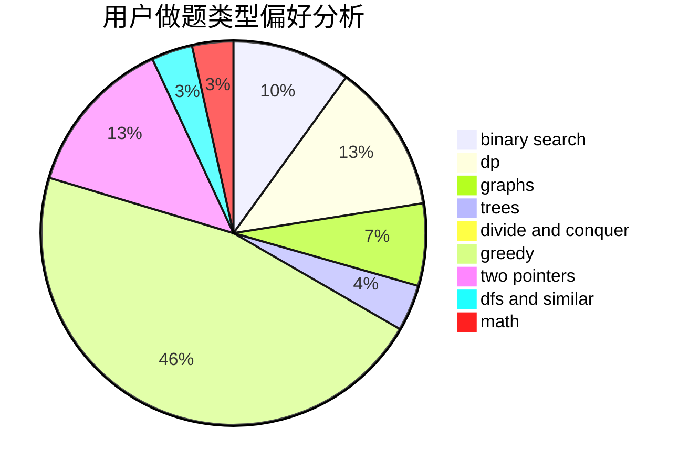

# jy1lnz

<!-- tabs:start -->

#### **用户提交结果分析**

#### **用户做题类型偏好分析**

<!-- tabs:end -->
# 推荐题目
[7C](https://codeforces.com/contest/7/problem/C)
[768G](https://codeforces.com/contest/768/problem/G)
[689B](https://codeforces.com/contest/689/problem/B)
[611C](https://codeforces.com/contest/611/problem/C)
[359B](https://codeforces.com/contest/359/problem/B)
[687A](https://codeforces.com/contest/687/problem/A)
[900E](https://codeforces.com/contest/900/problem/E)
[550D](https://codeforces.com/contest/550/problem/D)
[175B](https://codeforces.com/contest/175/problem/B)
[777A](https://codeforces.com/contest/777/problem/A)
