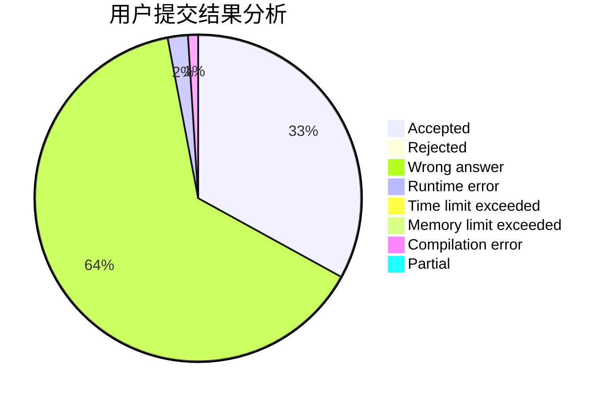
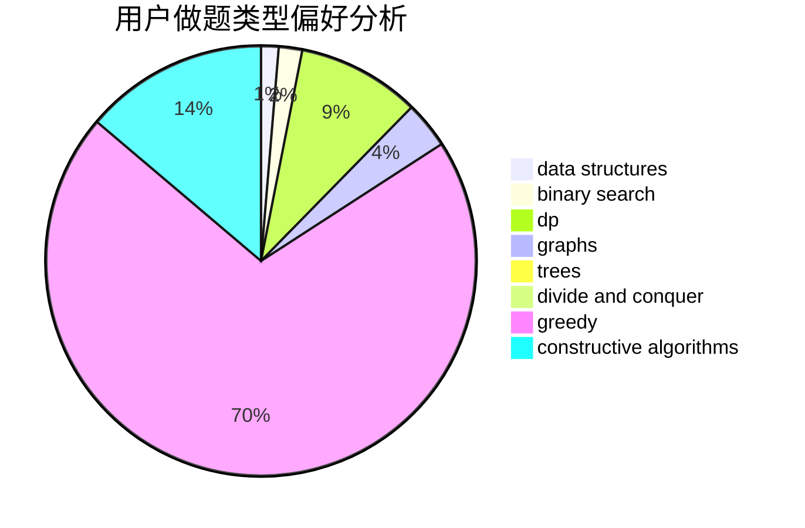
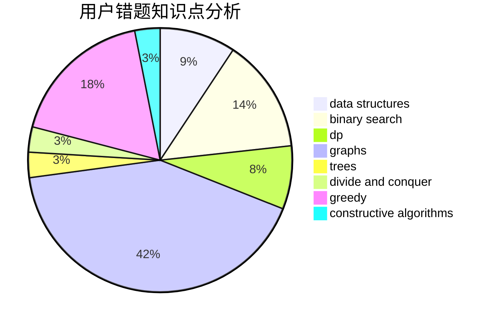

# jy1lnz

<!-- tabs:start -->

#### **用户提交结果分析**

#### **用户做题类型偏好分析**

#### **用户错题知识点分析**

<!-- tabs:end -->
# 推荐题目
[781E](https://codeforces.com/contest/781/problem/E)		dsu,graphs,sortings,trees		  
[74A](https://codeforces.com/contest/74/problem/A)		implementation		  
[667B](https://codeforces.com/contest/667/problem/B)		constructive algorithms,
                        geometry		  
[592A](https://codeforces.com/contest/592/problem/A)		implementation		  
[331C1](https://codeforces.com/contest/331C/problem/1)		dp		  
[666A](https://codeforces.com/contest/666/problem/A)		dp,
                        implementation,
                        strings		  
[883F](https://codeforces.com/contest/883/problem/F)		implementation		  
[526E](https://codeforces.com/contest/526/problem/E)		dp,
                        implementation		  
[152E](https://codeforces.com/contest/152/problem/E)		bitmasks,
                        dp,
                        graphs,
                        trees		  
[757G](https://codeforces.com/contest/757/problem/G)		data structures,
                        divide and conquer,
                        graphs,
                        trees		  
