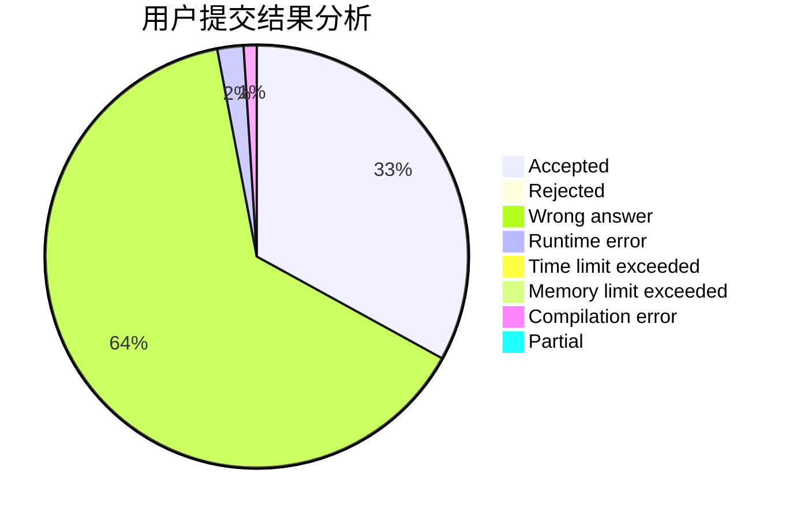
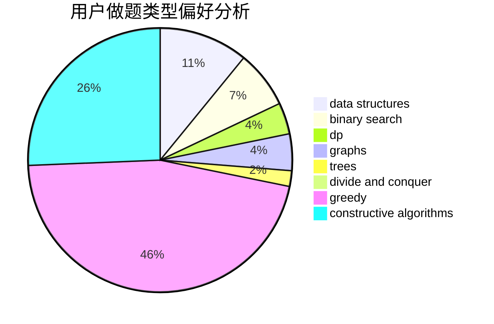
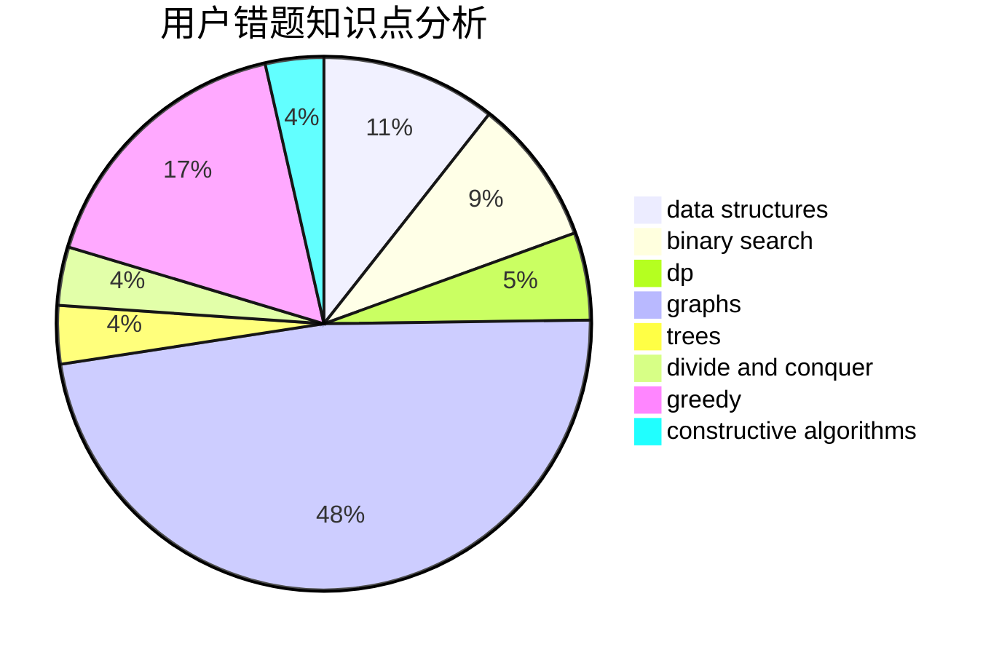

# jy1lnz

<!-- tabs:start -->

#### **用户提交结果分析**

#### **用户做题类型偏好分析**

#### **用户错题知识点分析**

<!-- tabs:end -->
# 推荐题目
[7C](https://codeforces.com/contest/7/problem/C)		math,
                        number theory		  
[768G](https://codeforces.com/contest/768/problem/G)		binary search,
                        data structures		  
[689B](https://codeforces.com/contest/689/problem/B)		dfs and similar,
                        graphs,
                        greedy,
                        shortest paths		  
[611C](https://codeforces.com/contest/611/problem/C)		dp,
                        implementation		  
[359B](https://codeforces.com/contest/359/problem/B)		constructive algorithms,
                        dp,
                        math		  
[687A](https://codeforces.com/contest/687/problem/A)		dfs and similar,
                        graphs		  
[900E](https://codeforces.com/contest/900/problem/E)		data structures,
                        dp,
                        strings		  
[550D](https://codeforces.com/contest/550/problem/D)		constructive algorithms,
                        graphs,
                        implementation		  
[175B](https://codeforces.com/contest/175/problem/B)		implementation		  
[777A](https://codeforces.com/contest/777/problem/A)		constructive algorithms,
                        implementation,
                        math		  
