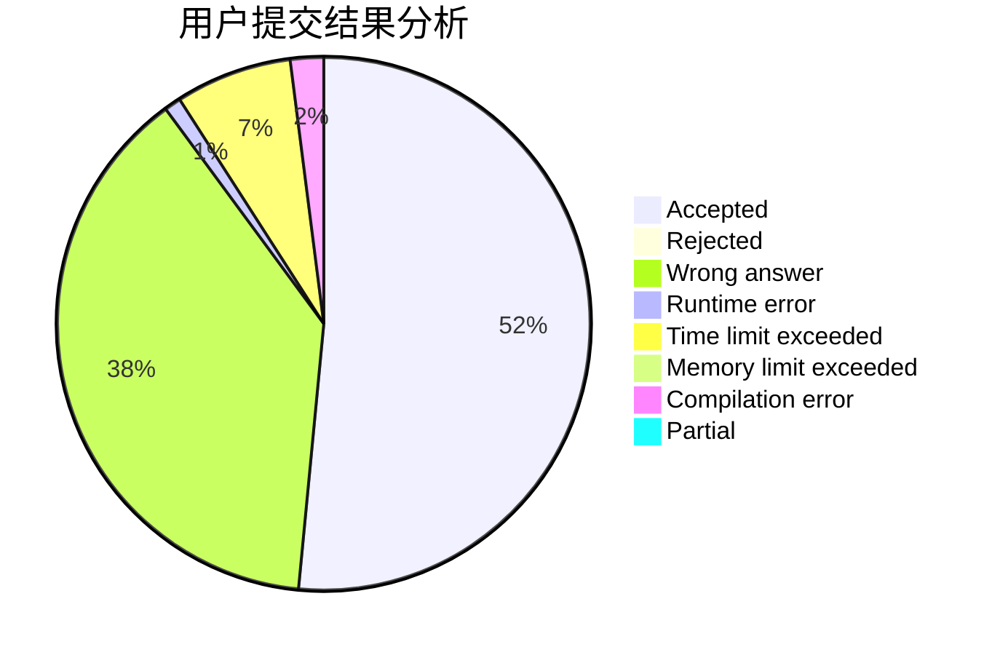
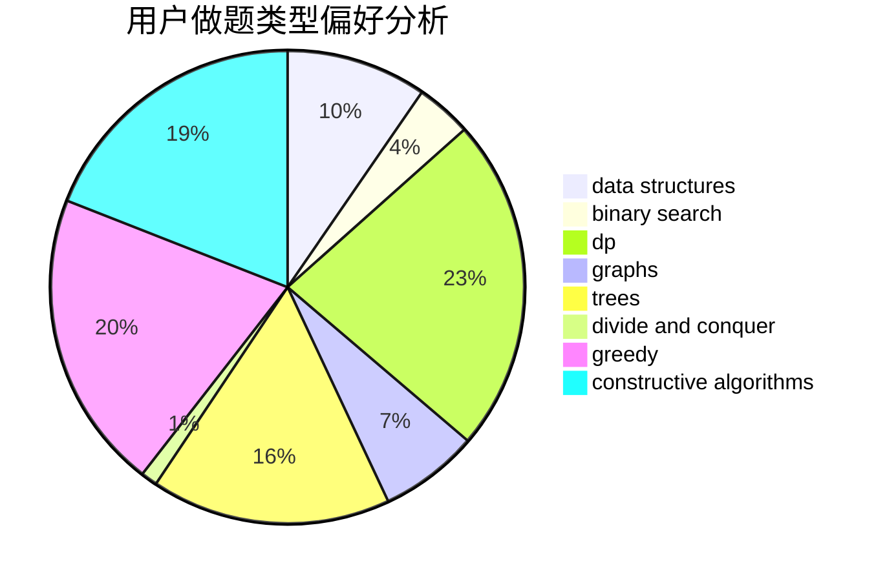
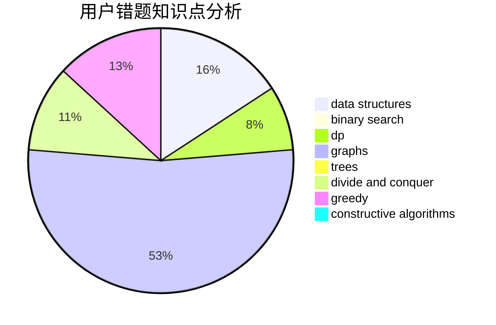

# jyf111

<!-- tabs:start -->

#### **用户提交结果分析**

#### **用户做题类型偏好分析**

#### **用户错题知识点分析**

<!-- tabs:end -->
# 推荐题目
[1423I](https://codeforces.com/contest/1423/problem/I)		bitmasks		  
[835C](https://codeforces.com/contest/835/problem/C)		dp,
                        implementation		  
[494B](https://codeforces.com/contest/494/problem/B)		dp,
                        strings		  
[727A](https://codeforces.com/contest/727/problem/A)		brute force,
                        dfs and similar,
                        math		  
[528C](https://codeforces.com/contest/528/problem/C)		dsu,graphs,sortings,trees		  
[1394E](https://codeforces.com/contest/1394/problem/E)		strings		  
[1118B](https://codeforces.com/contest/1118/problem/B)		implementation		  
[546D](https://codeforces.com/contest/546/problem/D)		constructive algorithms,
                        dp,
                        math,
                        number theory		  
[602A](https://codeforces.com/contest/602/problem/A)		brute force,
                        implementation		  
[1004B](https://codeforces.com/contest/1004/problem/B)		constructive algorithms,
                        greedy,
                        implementation,
                        math		  
