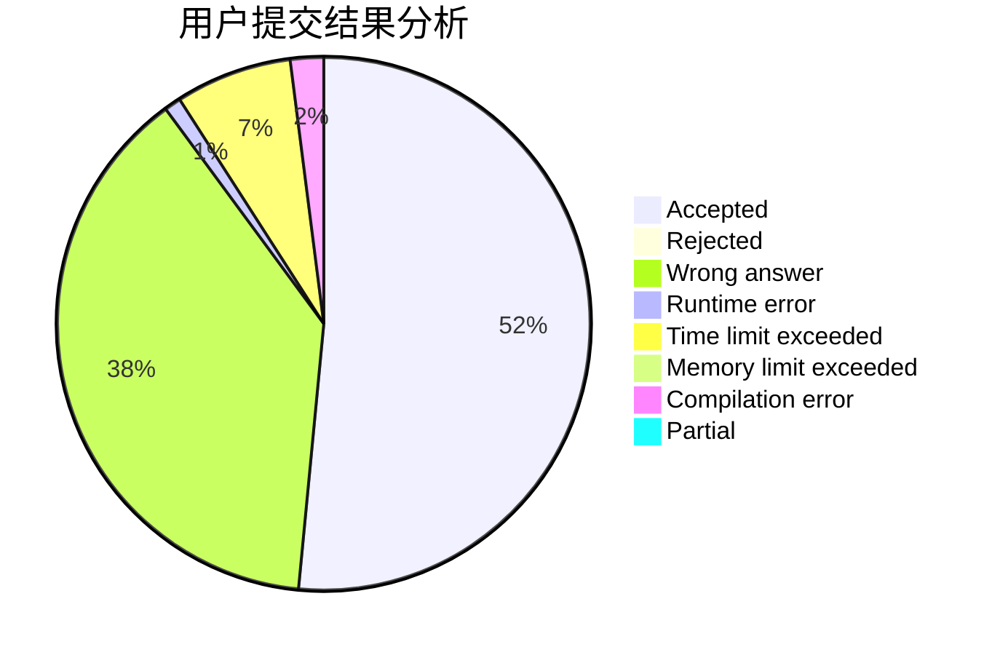
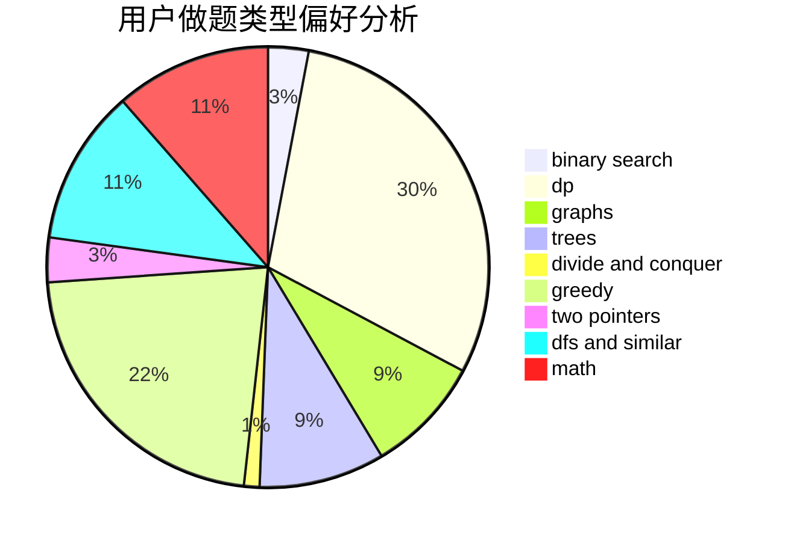

# jyf111

<!-- tabs:start -->

#### **用户提交结果分析**

#### **用户做题类型偏好分析**

<!-- tabs:end -->
# 推荐题目
[1423I](https://codeforces.com/contest/1423/problem/I)
[835C](https://codeforces.com/contest/835/problem/C)
[494B](https://codeforces.com/contest/494/problem/B)
[727A](https://codeforces.com/contest/727/problem/A)
[528C](https://codeforces.com/contest/528/problem/C)
[1394E](https://codeforces.com/contest/1394/problem/E)
[1118B](https://codeforces.com/contest/1118/problem/B)
[546D](https://codeforces.com/contest/546/problem/D)
[602A](https://codeforces.com/contest/602/problem/A)
[1004B](https://codeforces.com/contest/1004/problem/B)
