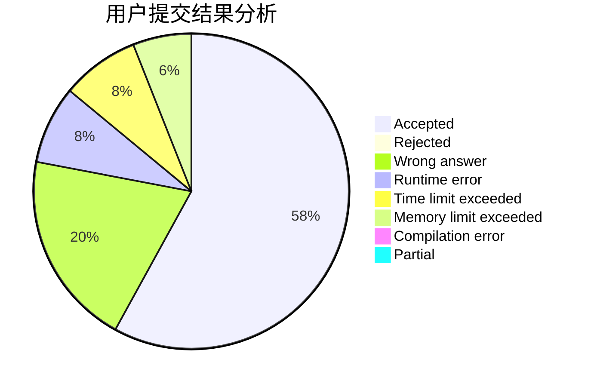
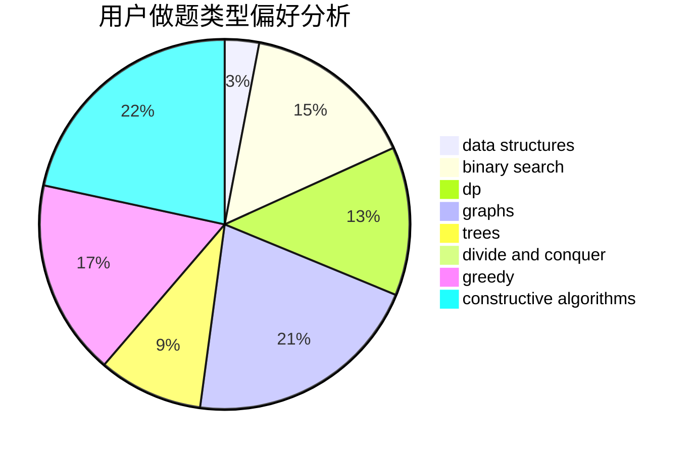
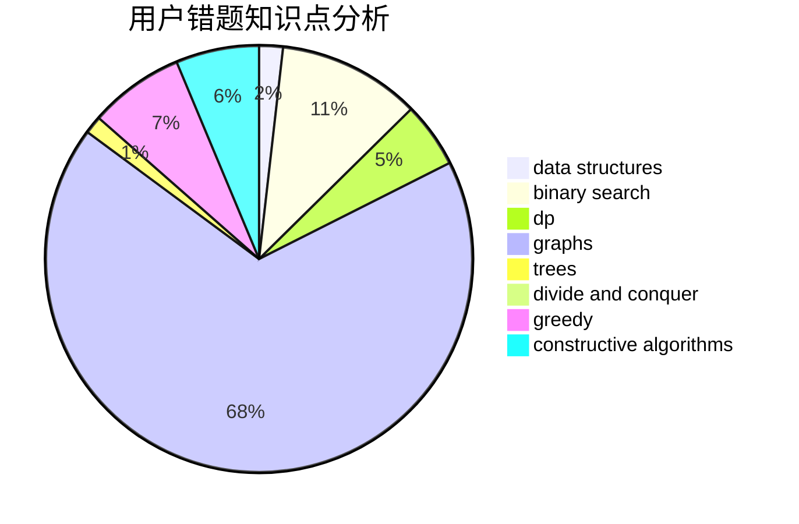

# jyttoby

<!-- tabs:start -->

#### **用户提交结果分析**

#### **用户做题类型偏好分析**

#### **用户错题知识点分析**

<!-- tabs:end -->
# 推荐题目
[1422B](https://codeforces.com/contest/1422/problem/B)		greedy,
                        implementation,
                        math		  
[700D](https://codeforces.com/contest/700/problem/D)		data structures,
                        greedy		  
[1366B](https://codeforces.com/contest/1366/problem/B)		math,
                        two pointers		  
[498B](https://codeforces.com/contest/498/problem/B)		dp,
                        probabilities,
                        two pointers		  
[865G](https://codeforces.com/contest/865/problem/G)		combinatorics,
                        math,
                        matrices		  
[601B](https://codeforces.com/contest/601/problem/B)		data structures,
                        math		  
[356B](https://codeforces.com/contest/356/problem/B)		implementation,
                        math		  
[1090M](https://codeforces.com/contest/1090/problem/M)		implementation		  
[717E](https://codeforces.com/contest/717/problem/E)		dfs and similar		  
[866E](https://codeforces.com/contest/866/problem/E)		dsu,graphs,sortings,trees		  
