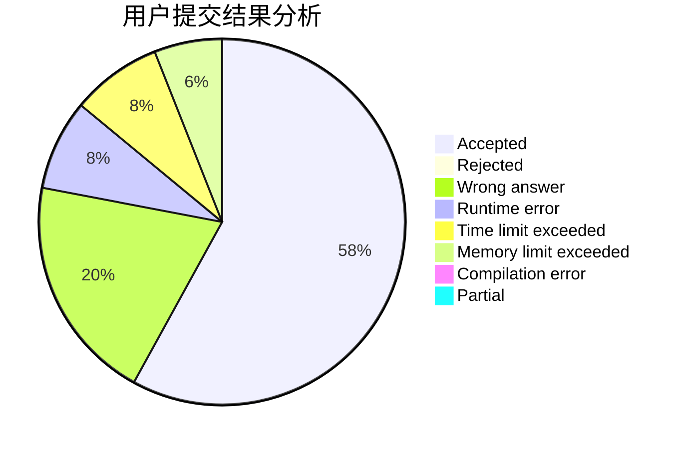
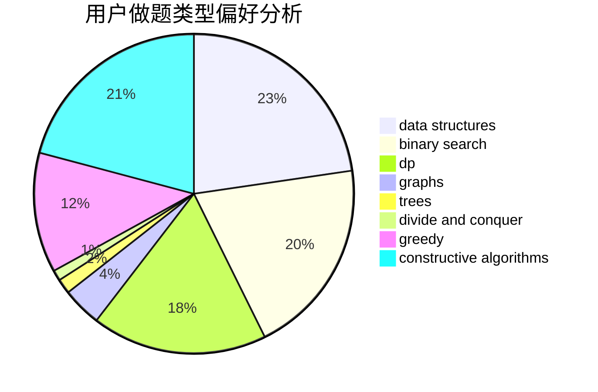
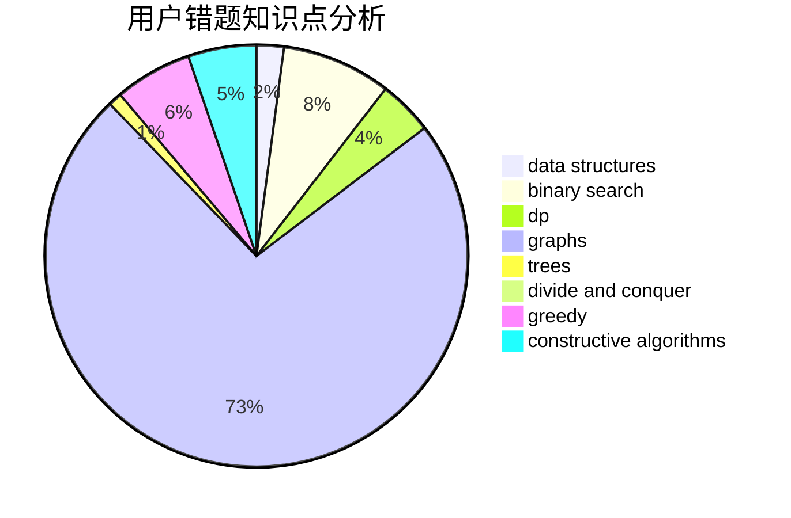

# jyttoby

<!-- tabs:start -->

#### **用户提交结果分析**

#### **用户做题类型偏好分析**

#### **用户错题知识点分析**

<!-- tabs:end -->
# 推荐题目
[1411G](https://codeforces.com/contest/1411/problem/G)		bitmasks,
                        games,
                        math,
                        matrices		  
[676D](https://codeforces.com/contest/676/problem/D)		graphs,
                        implementation,
                        shortest paths		  
[1357E2](https://codeforces.com/contest/1357E/problem/2)		nan		  
[478B](https://codeforces.com/contest/478/problem/B)		combinatorics,
                        constructive algorithms,
                        greedy,
                        math		  
[847F](https://codeforces.com/contest/847/problem/F)		greedy,
                        sortings		  
[581A](https://codeforces.com/contest/581/problem/A)		implementation,
                        math		  
[327A](https://codeforces.com/contest/327/problem/A)		brute force,
                        dp,
                        implementation		  
[1090B](https://codeforces.com/contest/1090/problem/B)		nan		  
[6C](https://codeforces.com/contest/6/problem/C)		greedy,
                        two pointers		  
[848B](https://codeforces.com/contest/848/problem/B)		constructive algorithms,
                        data structures,
                        geometry,
                        implementation,
                        sortings,
                        two pointers		  
