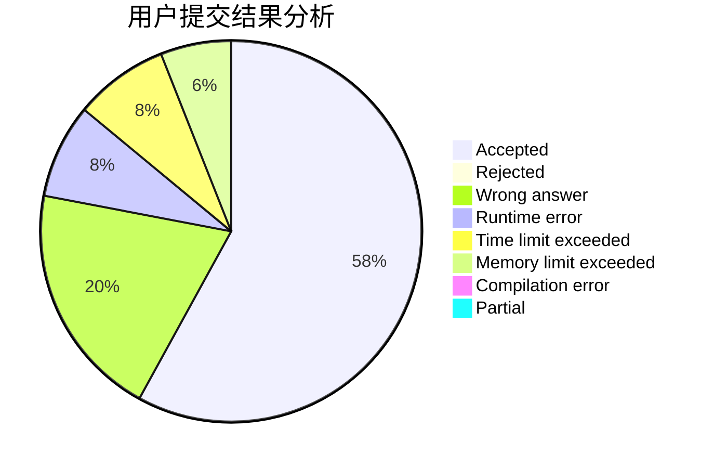
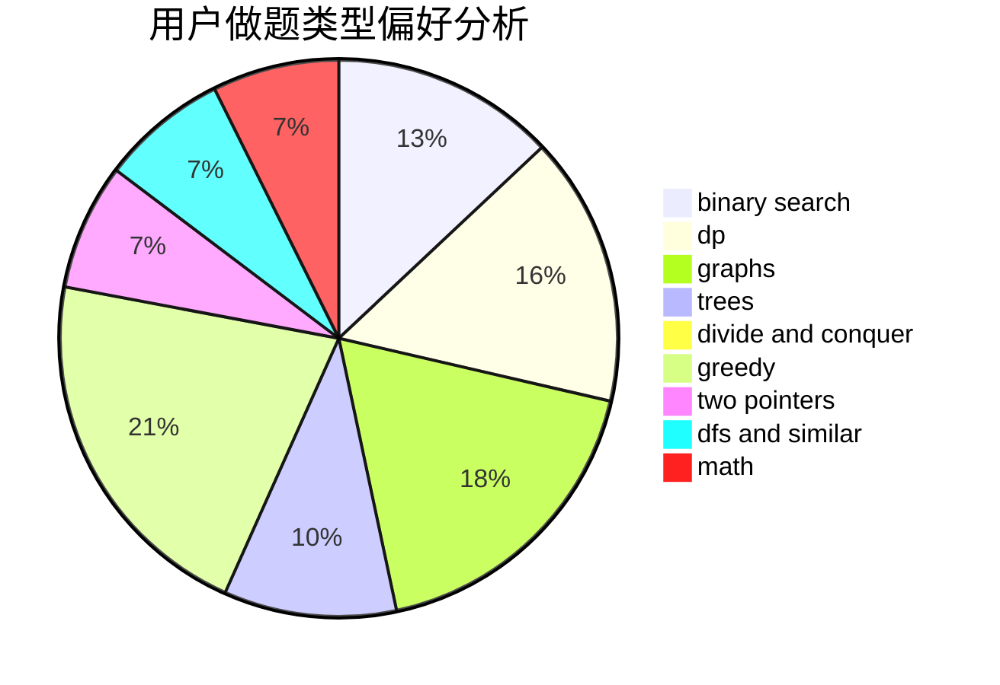

# jyttoby

<!-- tabs:start -->

#### **用户提交结果分析**

#### **用户做题类型偏好分析**

<!-- tabs:end -->
# 推荐题目
[1422B](https://codeforces.com/contest/1422/problem/B)
[700D](https://codeforces.com/contest/700/problem/D)
[1366B](https://codeforces.com/contest/1366/problem/B)
[498B](https://codeforces.com/contest/498/problem/B)
[865G](https://codeforces.com/contest/865/problem/G)
[601B](https://codeforces.com/contest/601/problem/B)
[356B](https://codeforces.com/contest/356/problem/B)
[1090M](https://codeforces.com/contest/1090/problem/M)
[717E](https://codeforces.com/contest/717/problem/E)
[866E](https://codeforces.com/contest/866/problem/E)
