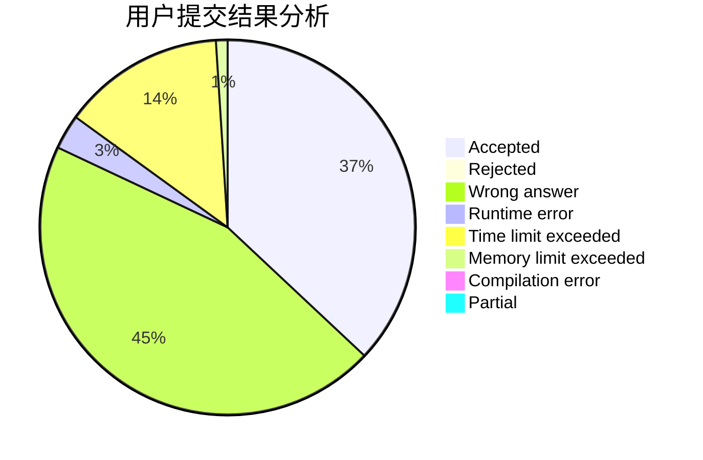
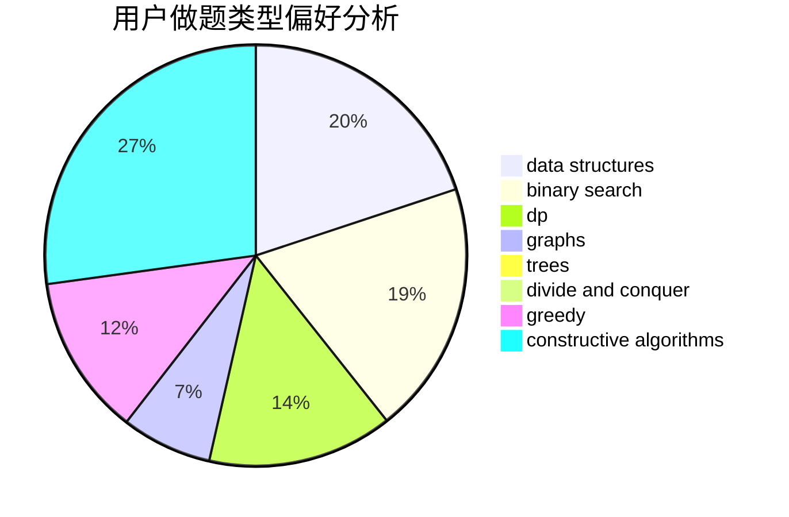
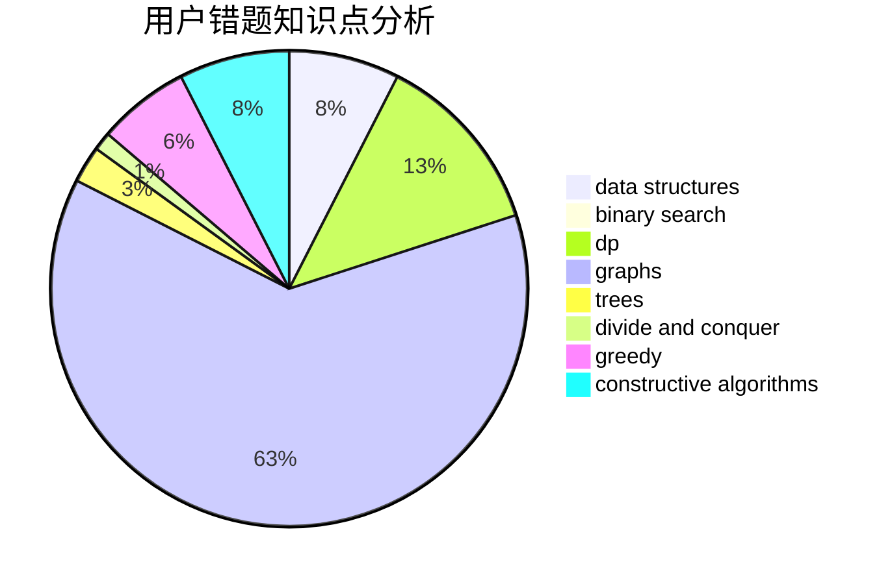

# jz_597

<!-- tabs:start -->

#### **用户提交结果分析**

#### **用户做题类型偏好分析**

#### **用户错题知识点分析**

<!-- tabs:end -->
# 推荐题目
[928B](https://codeforces.com/contest/928/problem/B)		*special problem,
                        dp		  
[1109A](https://codeforces.com/contest/1109/problem/A)		dp,
                        implementation		  
[877D](https://codeforces.com/contest/877/problem/D)		data structures,
                        dfs and similar,
                        graphs,
                        shortest paths		  
[1270F](https://codeforces.com/contest/1270/problem/F)		math,
                        strings		  
[1199E](https://codeforces.com/contest/1199/problem/E)		dsu,graphs,sortings,trees		  
[409B](https://codeforces.com/contest/409/problem/B)		*special problem		  
[1051F](https://codeforces.com/contest/1051/problem/F)		graphs,
                        shortest paths,
                        trees		  
[1303D](https://codeforces.com/contest/1303/problem/D)		bitmasks,
                        greedy		  
[1202D](https://codeforces.com/contest/1202/problem/D)		combinatorics,
                        constructive algorithms,
                        math,
                        strings		  
[690A2](https://codeforces.com/contest/690A/problem/2)		nan		  
