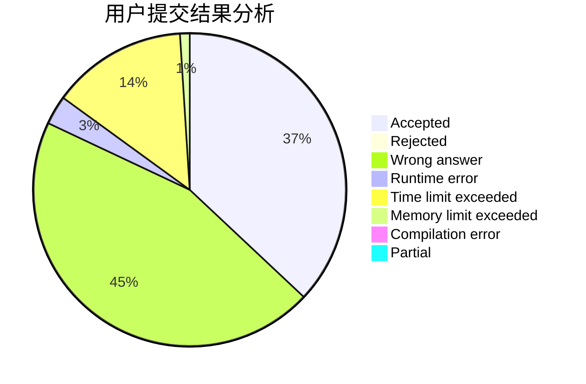
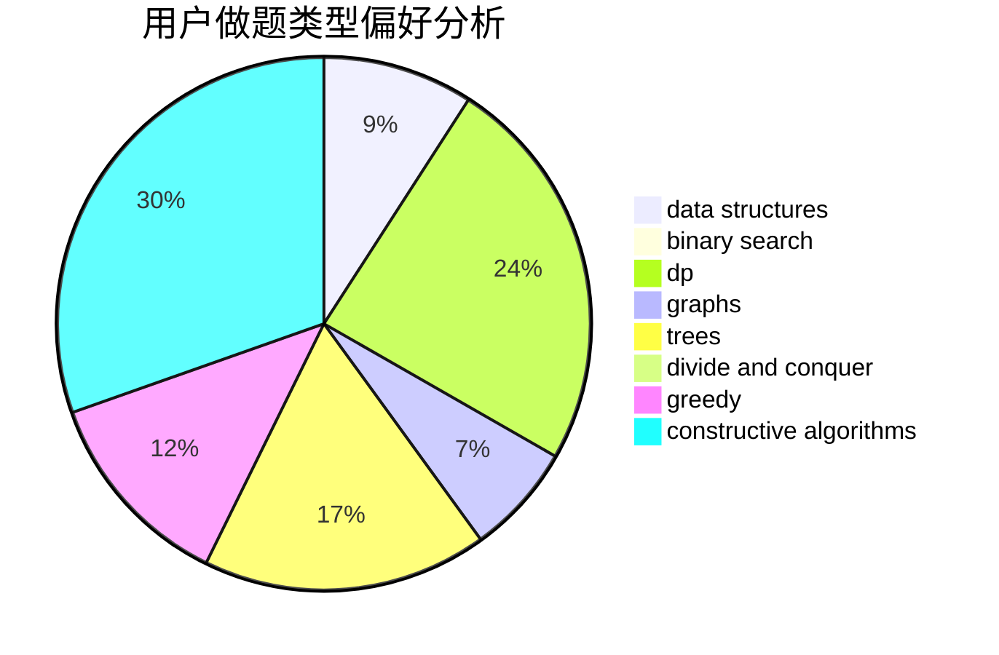
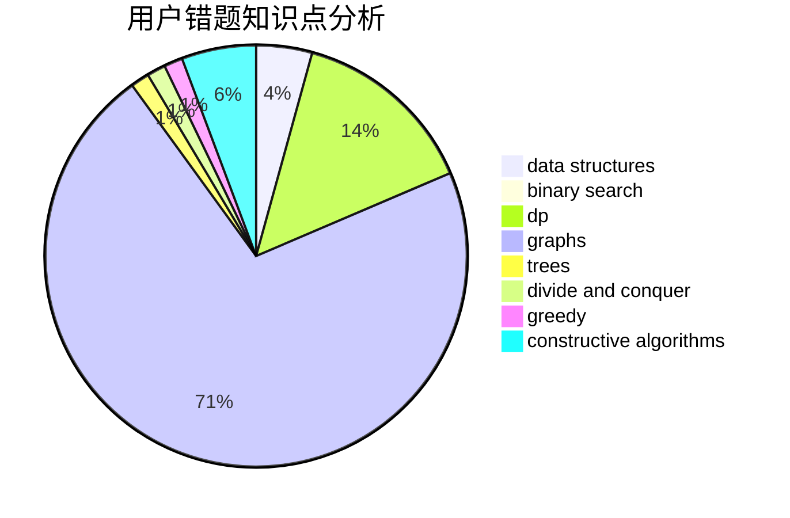

# jz_597

<!-- tabs:start -->

#### **用户提交结果分析**

#### **用户做题类型偏好分析**

#### **用户错题知识点分析**

<!-- tabs:end -->
# 推荐题目
[949E](https://codeforces.com/contest/949/problem/E)		brute force		  
[1109E](https://codeforces.com/contest/1109/problem/E)		data structures,
                        number theory		  
[898C](https://codeforces.com/contest/898/problem/C)		implementation,
                        strings		  
[1279F](https://codeforces.com/contest/1279/problem/F)		binary search,
                        dp		  
[1203A](https://codeforces.com/contest/1203/problem/A)		implementation		  
[436D](https://codeforces.com/contest/436/problem/D)		dp		  
[1053B](https://codeforces.com/contest/1053/problem/B)		dsu,graphs,sortings,trees		  
[1312B](https://codeforces.com/contest/1312/problem/B)		constructive algorithms,
                        sortings		  
[1207B](https://codeforces.com/contest/1207/problem/B)		constructive algorithms,
                        greedy,
                        implementation		  
[710C](https://codeforces.com/contest/710/problem/C)		constructive algorithms,
                        math		  
