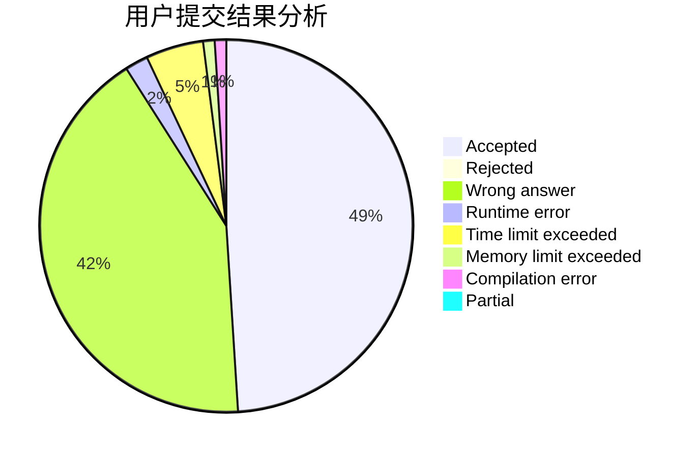
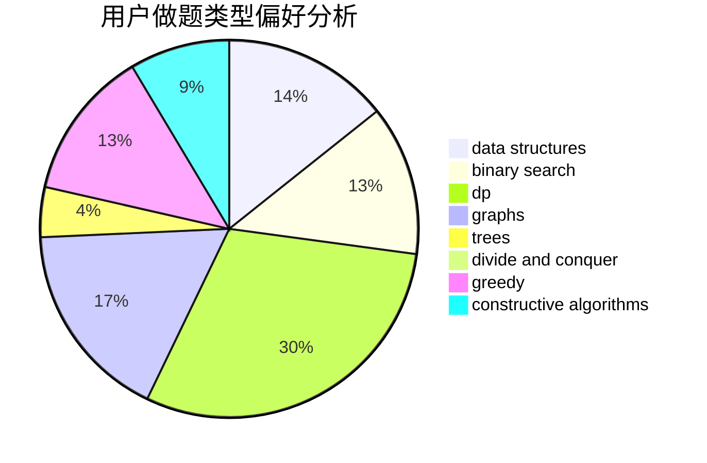
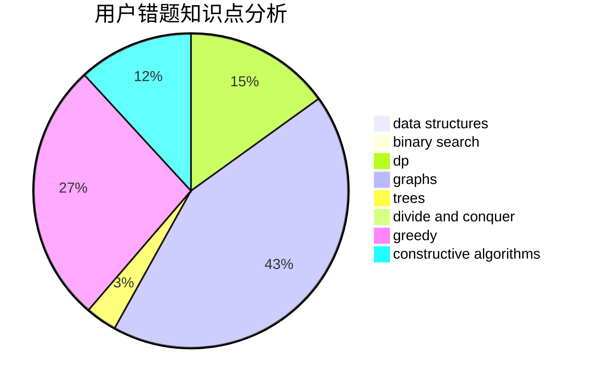

# BenFromHUST

<!-- tabs:start -->

#### **用户提交结果分析**

#### **用户做题类型偏好分析**

#### **用户错题知识点分析**

<!-- tabs:end -->
# 推荐题目
[1481D](https://codeforces.com/contest/1481/problem/D)		brute force,
                        constructive algorithms,
                        graphs,
                        greedy,
                        implementation		  
[545E](https://codeforces.com/contest/545/problem/E)		graphs,
                        greedy,
                        shortest paths		  
[546D](https://codeforces.com/contest/546/problem/D)		constructive algorithms,
                        dp,
                        math,
                        number theory		  
[1055C](https://codeforces.com/contest/1055/problem/C)		math,
                        number theory		  
[545A](https://codeforces.com/contest/545/problem/A)		implementation		  
[545B](https://codeforces.com/contest/545/problem/B)		greedy		  
[546C](https://codeforces.com/contest/546/problem/C)		brute force,
                        dfs and similar,
                        games		  
[1180D](https://codeforces.com/contest/1180/problem/D)		dsu,graphs,sortings,trees		  
[1290E](https://codeforces.com/contest/1290/problem/E)		data structures		  
[1042A](https://codeforces.com/contest/1042/problem/A)		binary search,
                        implementation		  
