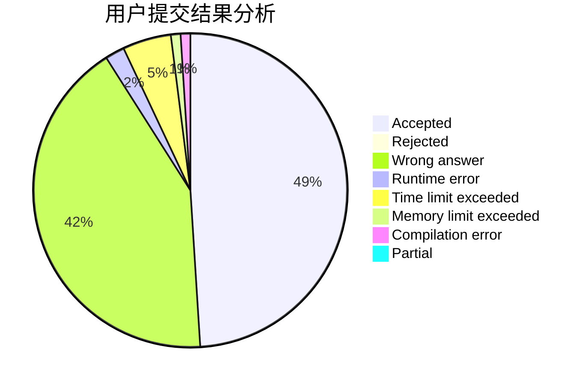
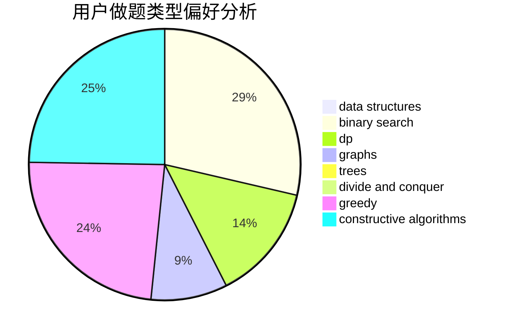
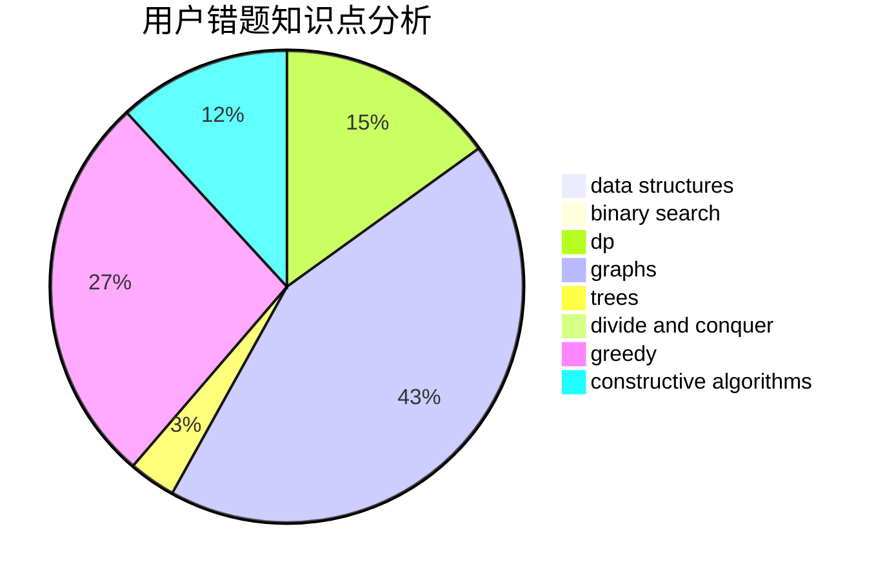

# BenFromHUST

<!-- tabs:start -->

#### **用户提交结果分析**

#### **用户做题类型偏好分析**

#### **用户错题知识点分析**

<!-- tabs:end -->
# 推荐题目
[1473A](https://codeforces.com/contest/1473/problem/A)		greedy,
                        implementation,
                        math,
                        sortings		  
[520A](https://codeforces.com/contest/520/problem/A)		implementation,
                        strings		  
[520E](https://codeforces.com/contest/520/problem/E)		combinatorics,
                        dp,
                        math,
                        number theory		  
[1054H](https://codeforces.com/contest/1054/problem/H)		chinese remainder theorem,
                        fft,
                        math,
                        number theory		  
[519E](https://codeforces.com/contest/519/problem/E)		binary search,
                        data structures,
                        dfs and similar,
                        dp,
                        trees		  
[51A](https://codeforces.com/contest/51/problem/A)		implementation		  
[520C](https://codeforces.com/contest/520/problem/C)		math,
                        strings		  
[1178E](https://codeforces.com/contest/1178/problem/E)		brute force,
                        constructive algorithms,
                        greedy,
                        strings		  
[1283E](https://codeforces.com/contest/1283/problem/E)		dp,
                        greedy		  
[1041D](https://codeforces.com/contest/1041/problem/D)		binary search,
                        data structures,
                        two pointers		  
