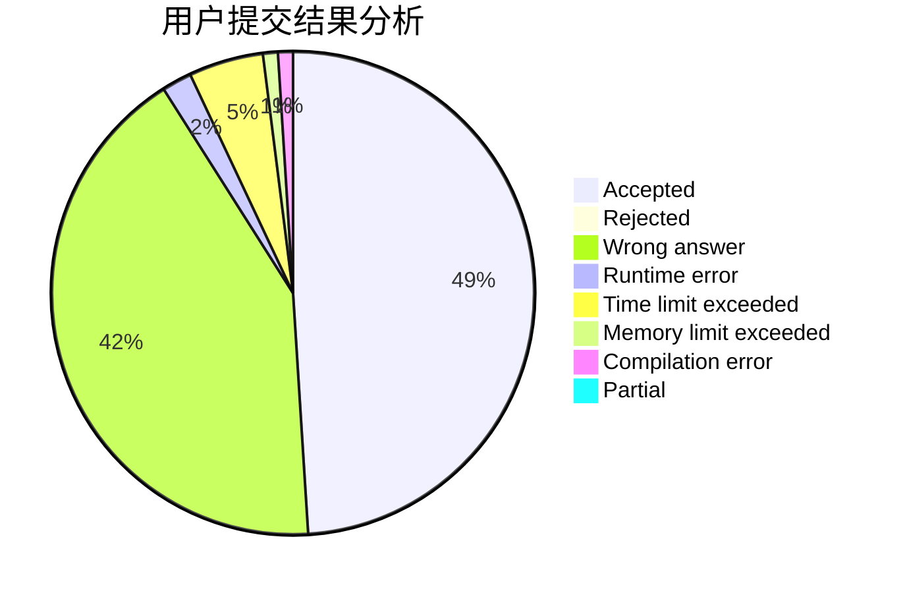
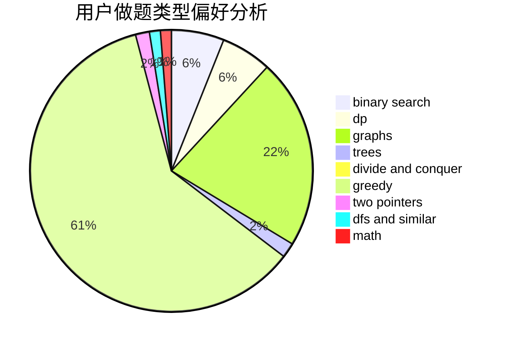

# BenFromHUST

<!-- tabs:start -->

#### **用户提交结果分析**

#### **用户做题类型偏好分析**

<!-- tabs:end -->
# 推荐题目
[1481D](https://codeforces.com/contest/1481/problem/D)
[545E](https://codeforces.com/contest/545/problem/E)
[546D](https://codeforces.com/contest/546/problem/D)
[1055C](https://codeforces.com/contest/1055/problem/C)
[545A](https://codeforces.com/contest/545/problem/A)
[545B](https://codeforces.com/contest/545/problem/B)
[546C](https://codeforces.com/contest/546/problem/C)
[1180D](https://codeforces.com/contest/1180/problem/D)
[1290E](https://codeforces.com/contest/1290/problem/E)
[1042A](https://codeforces.com/contest/1042/problem/A)
