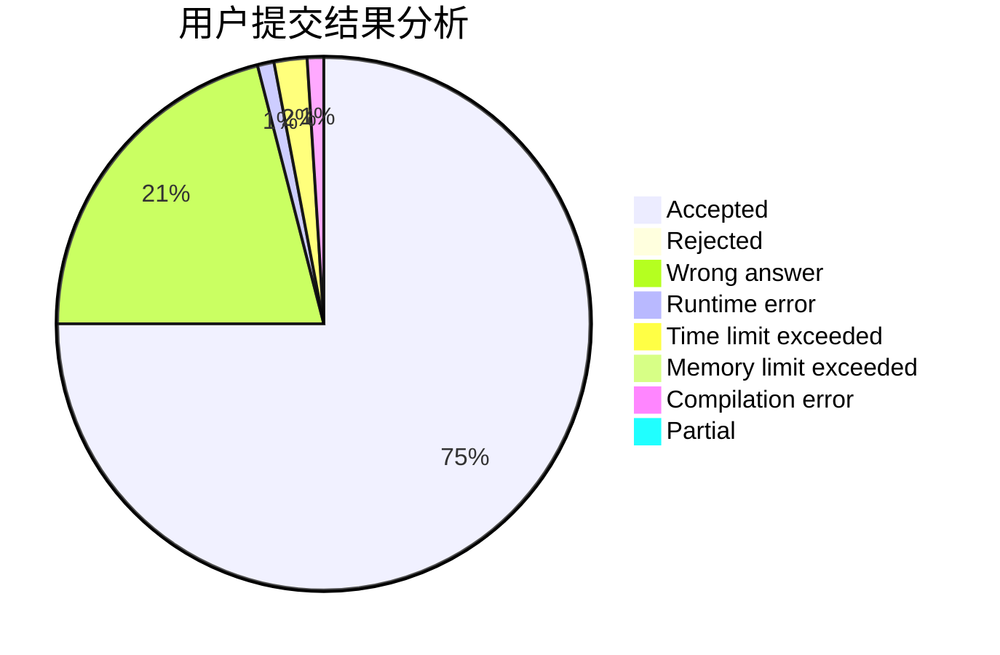
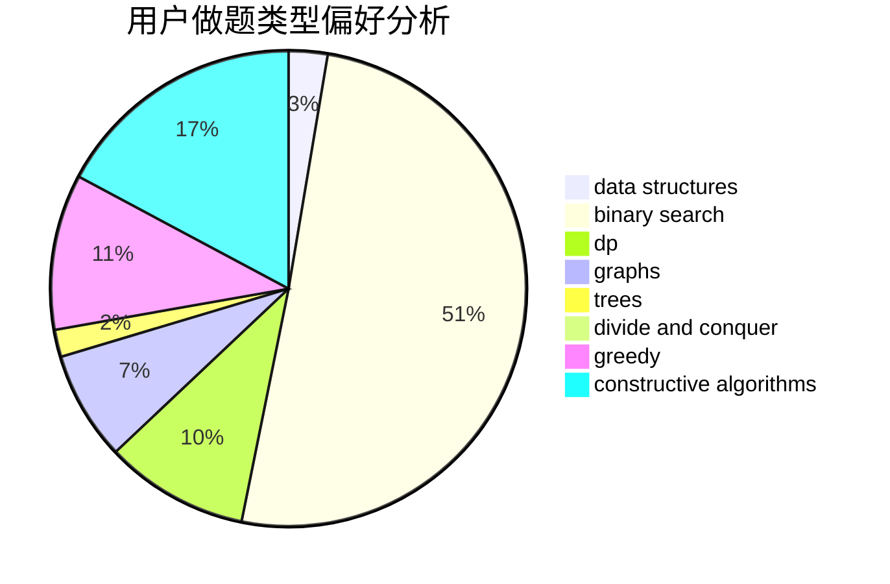
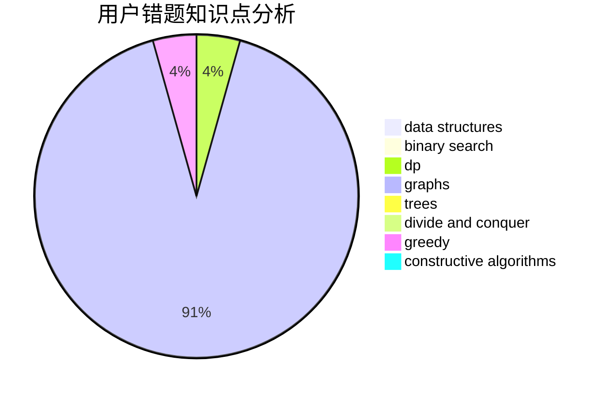

# jzp

<!-- tabs:start -->

#### **用户提交结果分析**

#### **用户做题类型偏好分析**

#### **用户错题知识点分析**

<!-- tabs:end -->
# 推荐题目
[1220E](https://codeforces.com/contest/1220/problem/E)		dfs and similar,
                        dp,
                        dsu,
                        graphs,
                        greedy,
                        trees		  
[928B](https://codeforces.com/contest/928/problem/B)		*special problem,
                        dp		  
[1061F](https://codeforces.com/contest/1061/problem/F)		interactive,
                        probabilities		  
[1388E](https://codeforces.com/contest/1388/problem/E)		data structures,
                        geometry,
                        sortings		  
[49E](https://codeforces.com/contest/49/problem/E)		dp		  
[251A](https://codeforces.com/contest/251/problem/A)		binary search,
                        combinatorics,
                        two pointers		  
[232E](https://codeforces.com/contest/232/problem/E)		bitmasks,
                        divide and conquer,
                        dp		  
[282A](https://codeforces.com/contest/282/problem/A)		implementation		  
[975A](https://codeforces.com/contest/975/problem/A)		implementation,
                        strings		  
[526B](https://codeforces.com/contest/526/problem/B)		dfs and similar,
                        greedy,
                        implementation		  
