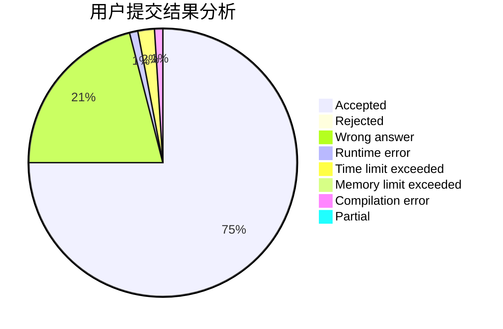
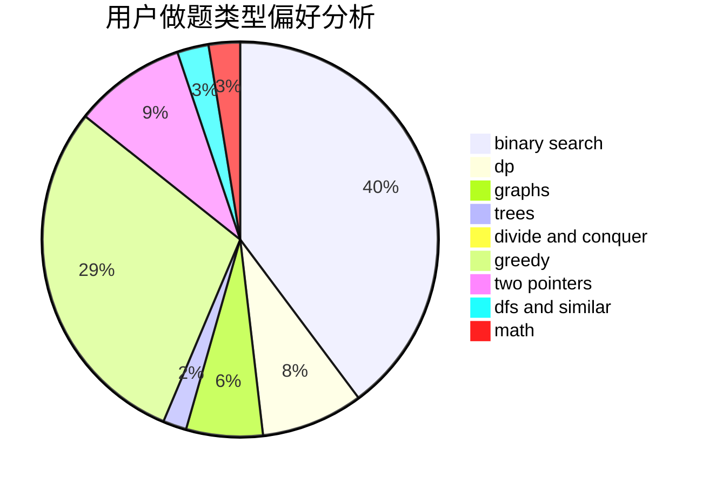

# jzp

<!-- tabs:start -->

#### **用户提交结果分析**

#### **用户做题类型偏好分析**

<!-- tabs:end -->
# 推荐题目
[1220E](https://codeforces.com/contest/1220/problem/E)
[928B](https://codeforces.com/contest/928/problem/B)
[1061F](https://codeforces.com/contest/1061/problem/F)
[1388E](https://codeforces.com/contest/1388/problem/E)
[49E](https://codeforces.com/contest/49/problem/E)
[251A](https://codeforces.com/contest/251/problem/A)
[232E](https://codeforces.com/contest/232/problem/E)
[282A](https://codeforces.com/contest/282/problem/A)
[975A](https://codeforces.com/contest/975/problem/A)
[526B](https://codeforces.com/contest/526/problem/B)
